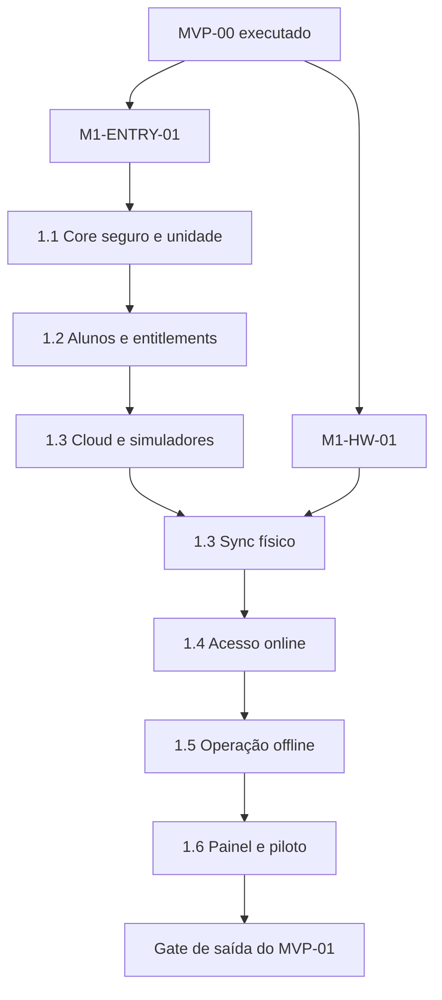

# MVP 01 Smart Access Implementation Plan

> **For agentic workers:** REQUIRED SUB-SKILL: Use superpowers:subagent-driven-development (recommended) or superpowers:executing-plans to implement this plan task-by-task. Steps use checkbox (`- [ ]`) syntax for tracking.

**Goal:** Entregar a primeira unidade do ArenaHub operando acesso físico online e offline, com isolamento multi-tenant, entitlement explícito, biometria consentida, trilha auditável e contingência segura.

**Architecture:** O MVP estende a fundação do Edge Agent criada no MVP-00 com um monólito modular NestJS, painel Next.js, PostgreSQL/Prisma e workers BullMQ. O cloud permanece source of truth; o Edge executa comandos físicos, mantém snapshots assinados e uma outbox SQLite. O trabalho é dividido em seis planos executáveis para preservar gates, commits pequenos e rastreabilidade dos 62 requisitos do PRD.

**Tech Stack:** Node.js 24.15.0, pnpm 10.33.2, TypeScript 5.9.3, Next.js 16.3.1, React 19.2.8, NestJS 11.2.0, Prisma 7.9.1 com `@prisma/adapter-pg`, PostgreSQL 17, Redis 8, BullMQ 6.1.1, Jest 29.7.0, Vitest 4.1.10, Playwright 1.62.1 e Testcontainers 12.1.0.

---

## 1. Estado, premissas e stop gates

Este é um plano de execução; ele não declara que o MVP-00 já foi implementado ou aprovado. No estado atual do repositório existe documentação, mas ainda não existe o monorepo gerado pelo plano do MVP-00.

### Gate `M1-ENTRY-01` — fundação executada

Antes de iniciar o plano 1.1, confirmar:

- [ ] Tasks 1 a 12 de `2026-08-14-mvp-00-poc-topdata.md` concluídas;
- [ ] `pnpm lint`, `pnpm typecheck`, `pnpm test`, `pnpm test:integration`, `pnpm test:e2e` e `pnpm build` verdes;
- [ ] contratos do Edge, SQLite e simuladores presentes nos caminhos planejados no MVP-00;
- [ ] nenhuma alteração local não compreendida será sobrescrita.

Se o monorepo real divergir do mapa do MVP-00, atualizar os caminhos destes planos antes de alterar código. Não recriar a fundação em paralelo.

### Gate `M1-HW-01` — decisão física

Os planos 1.1 e 1.2 podem ser implementados sem hardware. A parte cloud/simulada do plano 1.3 também pode avançar, mas a execução física de 1.3 e os planos 1.4 a 1.6 exigem:

- [ ] `HW-GATE-01` com inventário real validado;
- [ ] decisão assinada `GO` ou `GO_WITH_CONSTRAINTS` no MVP-00;
- [ ] modelos, firmware, SDK, topologia e limite de latência copiados para `docs/operations/smart-access/supported-hardware.md`;
- [ ] bridge físico implementado pelo plano complementar do MVP-00;
- [ ] `NO_GO` ausente.

Com `GO_WITH_CONSTRAINTS`, cada restrição vira item explícito de teste e rollout. Com `NO_GO`, parar: não substituir o fabricante, o protocolo ou a política sem novo PRD/ADR.

### Gate `M1-OPS-01` — operação e privacidade

Antes de capturar biometria ou abrir a unidade piloto:

- [ ] termo de consentimento biométrico versionado e aprovado;
- [ ] política offline com validade, carência e fallback por unidade aprovada;
- [ ] responsáveis técnico e operacional por incidentes identificados;
- [ ] ambientes local, homologação e produção documentados;
- [ ] RPO de até 24 h, RTO e procedimento de restauração aprovados.

## 2. Ordem de execução



| Ordem | Plano | Resultado verificável | Bloqueio adicional |
|---|---|---|---|
| 1 | [1.1 Core seguro e unidade](./2026-08-14-mvp-01-01-core-security.md) | proprietário cria unidade e convida recepcionista isolada no tenant | `M1-ENTRY-01` |
| 2 | [1.2 Alunos e entitlements](./2026-08-14-mvp-01-02-students-entitlements.md) | recepção cadastra aluno e vê direito de acesso exato | 1.1 concluído |
| 3 | [1.3 Biometria e sync](./2026-08-14-mvp-01-03-biometrics-device-sync.md) | identidade consentida sincroniza e revogação remove acesso | 1.2; etapa física exige `M1-HW-01` e `M1-OPS-01` |
| 4 | [1.4 Decisão online](./2026-08-14-mvp-01-04-online-access.md) | reconhecimento, decisão, comando e passagem correlacionados | 1.3 físico concluído |
| 5 | [1.5 Operação offline](./2026-08-14-mvp-01-05-offline-operation.md) | cache válido decide e backlog reconcilia exatamente uma vez | 1.4 concluído e política offline aprovada |
| 6 | [1.6 Painel e prontidão](./2026-08-14-mvp-01-06-operational-dashboard.md) | turno piloto operado sem banco, terminal ou logs brutos | 1.5 concluído |

Não executar planos em paralelo quando houver dependência de schema, contrato ou estado indicada nesta tabela.

## 3. Decisões técnicas vinculantes

### 3.1 Autenticação e autorização

- access JWT RS256 com duração de 10 minutos e chave privada exclusiva da API;
- refresh token opaco, 256 bits, rotacionado a cada uso e armazenado somente como SHA-256 em `sessions`;
- senha derivada com `crypto.scrypt` e parâmetros versionados; nenhuma dependência nativa adicional;
- cookies `HttpOnly`, `Secure` em produção, `SameSite=Lax` e escopo mínimo;
- guard global de autenticação no NestJS; rotas públicas exigem decorator explícito;
- permissões avaliadas por `tenantId` e, quando houver, `gymUnitId` do principal autenticado;
- MFA TOTP obrigatório em produção para Proprietário, Super Admin e Operador técnico;
- elevação Super Admin exige justificativa, tenant alvo, expiração máxima de 30 minutos e auditoria.

### 3.2 Multi-tenancy

- `tenantId` nunca vem livremente de DTO de negócio;
- `TenantContext` é criado pelo guard e obrigatório em application services/repositories;
- todo `where`, `update`, `delete` e `upsert` de negócio inclui `tenantId` explícito;
- chaves únicas de negócio usam chave composta com `tenantId`;
- Prisma Client extensions podem reduzir repetição, mas não substituem repositórios nem testes de isolamento;
- testes de integração tentam leitura, alteração, enumeração e sync cruzado entre tenants.

### 3.3 Persistência e eventos

- `packages/database` é dono do schema Prisma, migrations e client factory;
- Prisma 7 usa `prisma.config.ts`, generator `prisma-client` e `PrismaPg` no runtime;
- mudanças de estado e `outbox_events` são gravadas na mesma transação;
- consumidores registram `inbox_receipts` antes do efeito externo;
- migrations de rollout são aditivas; remoção de coluna ocorre somente após Edge N e N-1 deixarem de usá-la;
- timestamps são UTC; regras de horário são avaliadas no timezone IANA da unidade.

### 3.4 API, web e Edge

- API administrativa versionada em `/api/v1` e erros `application/problem+json`;
- OpenAPI é gerado no build e comparado em teste de contrato;
- Server Components do Next consultam a API NestJS diretamente e encaminham somente os cookies necessários;
- `use client` fica nos formulários, filtros e componentes interativos;
- Edge autentica com chave própria rotacionável, `keyId`, timestamp, nonce e assinatura HMAC do corpo; sessão de usuário não é aceita;
- mutações administrativas autenticadas por cookie validam `Origin` e token CSRF ligado à sessão; rotas Edge usam o esquema HMAC e não compartilham essa exceção com rotas humanas;
- proteção contra replay persiste nonces por janela de cinco minutos;
- snapshots offline usam assinatura Ed25519 separada da credencial de transporte;
- o contrato de bridge do MVP-00 continua sendo a única fronteira com SDK/DLL do fabricante.

### 3.5 Privacidade

- ArenaHub não armazena template biométrico bruto quando o hardware não exigir;
- se o hardware exigir template intermediário, a execução para e exige ADR de retenção, criptografia e exclusão aprovado;
- fotos ficam em object storage privado e URLs temporárias;
- CPF normalizado pode participar da detecção de duplicidade, nunca de matrícula, ID externo ou log;
- revogação causa bloqueio lógico imediato e exclusão física assíncrona verificável.

## 4. Mapa de ownership

```text
apps/api/                         composição NestJS, HTTP, WebSocket e workers
apps/admin-web/                   painel Next.js e jornadas administrativas
apps/edge-agent/                  execução física, SQLite, cache e outbox local
packages/database/                Prisma, migrations e Testcontainers
packages/contracts/               DTOs/eventos Zod e OpenAPI gerado
packages/access-policy/           engine puro compartilhado cloud/Edge
packages/testing/                 builders, clocks e fixtures multi-tenant
infra/docker/                     PostgreSQL, Redis e MinIO locais
docs/adr/                         decisões arquiteturais imutáveis por commit
docs/operations/smart-access/     runbooks, hardware suportado e evidências
```

Regra de fronteira: módulos NestJS não consultam tabelas privadas de outro módulo. Integração ocorre por application service ou evento. `Access` pode ler uma projeção de entitlement publicada pelo módulo `Membership`, nunca a tabela de assinatura diretamente na catraca.

## 5. Contratos compartilhados

Criar em `packages/contracts/src/access.ts` e reutilizar na API e Edge:

```ts
export const ACCESS_POLICY_VERSION = '1.0.0' as const;

export type AccessReason =
  | 'ACTIVE_ENTITLEMENT'
  | 'NO_ENTITLEMENT'
  | 'OUTSIDE_SCHEDULE'
  | 'STUDENT_INACTIVE'
  | 'STUDENT_BLOCKED'
  | 'ADMIN_BLOCK'
  | 'SNAPSHOT_EXPIRED'
  | 'IDENTITY_UNKNOWN';

export type AccessDecision =
  | {
      outcome: 'ALLOW';
      reason: 'ACTIVE_ENTITLEMENT';
      validUntil: string;
      policyVersion: typeof ACCESS_POLICY_VERSION;
    }
  | {
      outcome: 'DENY';
      reason: Exclude<AccessReason, 'ACTIVE_ENTITLEMENT'>;
      policyVersion: typeof ACCESS_POLICY_VERSION;
    };

export interface DomainEvent<TPayload extends object> {
  eventId: string;
  eventType: string;
  occurredAt: string;
  tenantId: string;
  aggregateId: string;
  schemaVersion: 1;
  payload: TPayload;
}
```

Qualquer alteração incompatível cria `schemaVersion: 2`, contrato de compatibilidade N/N-1 e ADR antes de modificar produtores.

## 6. Convenção de execução por task

Toda task de cada plano segue esta ordem:

1. escrever teste que falha pela razão esperada;
2. executar o teste isolado e registrar a falha;
3. implementar o menor comportamento completo;
4. executar teste isolado, testes do pacote, lint e typecheck;
5. atualizar OpenAPI/migration/evidência aplicável;
6. revisar `git diff --check` e ausência de segredos;
7. criar o commit indicado sem incluir arquivos alheios.

Os comandos raiz obrigatórios ao final de cada slice são:

```bash
pnpm install --frozen-lockfile
pnpm lint
pnpm typecheck
pnpm test
pnpm test:integration
pnpm test:e2e
pnpm build
```

## 7. Matriz de cobertura do PRD

| Plano | Requisitos cobertos | Evidência principal |
|---|---|---|
| 1.1 | `M1-FR-001`, `M1-FR-002`, `M1-FR-003`, `M1-FR-004`, `M1-FR-005`; `M1-NFR-001`, `M1-NFR-005`, `M1-NFR-007`, `M1-NFR-008`, `M1-NFR-010`; `M1-AC-001` | migrations, auth/RBAC/tenant integration tests, E2E de convite e unidade |
| 1.2 | `M1-FR-006`, `M1-FR-007`, `M1-FR-008`, `M1-FR-009`, `M1-FR-010`, `M1-FR-011`, `M1-FR-012`; `M1-BR-001`, `M1-BR-002`, `M1-BR-003`, `M1-BR-006`, `M1-BR-010`; `M1-AC-002`, `M1-AC-003` | state-machine tests, transação subscription→entitlement, E2E da recepção |
| 1.3 | `M1-FR-013`, `M1-FR-014`, `M1-FR-015`, `M1-FR-016`, `M1-FR-017`, `M1-FR-018`; `M1-BR-004`, `M1-BR-005`; `M1-AC-004`, `M1-AC-007` | consent audit, BullMQ/inbox, simulador e smoke físico de upsert/delete |
| 1.4 | `M1-FR-019`, `M1-FR-020`, `M1-FR-021`, `M1-FR-022`, `M1-FR-023`, `M1-FR-024`; `M1-BR-002`, `M1-BR-003`, `M1-BR-006`, `M1-BR-007`, `M1-BR-009`; `M1-NFR-002`, `M1-NFR-003`; `M1-AC-005`, `M1-AC-006`, `M1-AC-008` | property tests, contrato Edge, correlação e ensaio de carga |
| 1.5 | `M1-FR-025`, `M1-FR-026`, `M1-FR-027`, `M1-FR-028`, `M1-FR-029`; `M1-BR-008`, `M1-BR-009`; `M1-NFR-002`, `M1-NFR-003`, `M1-NFR-004`, `M1-NFR-006`; `M1-AC-009`, `M1-AC-010` | assinatura de snapshot, fault tests, restart e reconciliação idempotente |
| 1.6 | `M1-FR-024`, `M1-FR-030`; `M1-NFR-005`, `M1-NFR-008`, `M1-NFR-009`, `M1-NFR-010`; `M1-AC-011`, `M1-AC-012` | dashboard, export assíncrono, alertas, restore, runbooks e turno piloto |

Todos os 30 FR, 10 BR, 10 NFR e 12 AC aparecem ao menos uma vez. Requisitos transversais repetidos são verificados no plano que produz sua evidência final.

## 8. Riscos que não podem ser diluídos em implementação

| Risco | Consequência | Controle/stop condition |
|---|---|---|
| MVP-00 ainda não executado | caminhos e contratos podem não existir | `M1-ENTRY-01` antes da primeira task |
| hardware/SDK não homologado | plano inventaria APIs físicas | `M1-HW-01`; nenhum stub conta como aceite físico |
| relógio do Edge divergente | snapshot/horário e replay inseguros | alerta a partir de 30 s; modo degradado e negação conforme política |
| regra cloud divergir do Edge | ALLOW inconsistente | um único `packages/access-policy` e golden tests nos dois runtimes |
| revogação física falhar | biometria permanece no dispositivo | bloqueio lógico imediato, retry, DLQ e confirmação por dispositivo |
| refresh token roubado | sessão prolongada | rotação, reuse detection e revogação da família |
| filtro de tenant omitido | vazamento crítico | repositórios tipados, constraints e testes cruzados; bloqueia release |
| offline ilimitado | acesso indevido prolongado | snapshot expira; nunca há allow sem limite |

## 9. Gate de saída do MVP-01

- [ ] todos os planos 1.1 a 1.6 concluídos com commits e evidências;
- [ ] `M1-AC-001` a `M1-AC-012` executados em homologação;
- [ ] piloto em modo observação sem comando físico concluído antes da janela assistida;
- [ ] piloto físico encerra um turno sem evento perdido ou acesso indevido conhecido;
- [ ] p95 físico respeita o limite aprovado no MVP-00;
- [ ] taxa diária de sync de identidades é pelo menos 99%, descontada indisponibilidade documentada;
- [ ] restore cloud e rollback Edge demonstrados por pessoa diferente do autor;
- [ ] alertas e responsáveis de incidente ativos;
- [ ] vulnerabilidades críticas e falhas de tenant isolation zeradas;
- [ ] PRD recebe links de commits, relatórios e runbooks; somente então muda para `CONCLUÍDO`.

## 10. Opções de execução

1. **Subagent-Driven (recomendado):** abrir uma execução por plano, revisar entre tasks e respeitar os gates do índice.
2. **Inline:** executar neste task, uma task por vez, mantendo os mesmos checkpoints e commits.

Em ambos os modos, iniciar por `M1-ENTRY-01`. O próximo arquivo executável é `2026-08-14-mvp-01-01-core-security.md`; não iniciar código físico apenas porque os planos existem.
