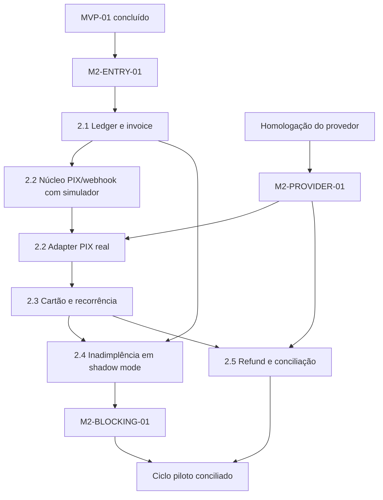

# MVP 02 Smart Billing Implementation Plan

> **For agentic workers:** REQUIRED SUB-SKILL: Use superpowers:subagent-driven-development (recommended) or superpowers:executing-plans to implement this plan task-by-task. Steps use checkbox (`- [ ]`) syntax for tracking.

**Goal:** Automatizar invoices, PIX, cartão tokenizado, recorrência, inadimplência, refunds e conciliação sem acoplar acesso físico ao provedor financeiro.

**Architecture:** O módulo Billing é adicionado ao monólito NestJS e persiste valores em centavos como `bigint`, movimentos financeiros imutáveis e eventos outbox. Webhooks autenticados entram por inbox durável e são normalizados antes de qualquer efeito. O módulo Membership continua dono da assinatura e do entitlement; Billing chama uma porta transacional explícita depois de confirmação elegível. O adapter real só é planejado depois do gate de homologação do provedor.

**Tech Stack:** Node.js 24.15.0, TypeScript 5.9.3, NestJS 11.2.0 com raw body, Prisma 7.9.1/PostgreSQL 17, Redis 8/BullMQ 6.1.1, Next.js 16.3.1/React 19.2.8, MinIO/S3 privado, Jest, Vitest, Playwright e Testcontainers.

---

## 1. Estado real e stop gates

O repositório contém os planos dos MVPs 0 e 1, mas não sua implementação. Este pacote não autoriza iniciar Billing sobre schemas imaginados.

### `M2-ENTRY-01` — Smart Access estável

Antes de código do plano 2.1:

- [ ] MVP-01 está `CONCLUÍDO`, com `M1-AC-001` a `M1-AC-012` aprovados;
- [ ] piloto Smart Access encerrou sem acesso indevido ou evento perdido conhecido;
- [ ] schemas reais de `plans`, `subscriptions`, `entitlements`, outbox, audit e feature flags estão versionados;
- [ ] porta transacional do módulo Membership e evento que aciona sync Edge estão estáveis;
- [ ] comandos raiz estão verdes no commit-base escolhido.

Se caminhos ou contratos reais divergirem dos planos do MVP-01, atualizar este pacote antes do primeiro patch.

### `M2-PROVIDER-01` — provedor homologado

Antes de qualquer chamada externa real nas slices 2.2, 2.3 ou 2.5:

- [ ] [plano de homologação](./2026-08-14-mvp-02-00-provider-homologation.md) concluído;
- [ ] um único provedor suporta PIX, cartão tokenizado hospedado, recorrência, webhook assinado/reenvio, cancelamento/refund e conciliação;
- [ ] conta sandbox e conta do CNPJ recebedor aprovadas;
- [ ] ADR e capability manifest assinados por Produto, Financeiro, Técnico e responsável legal;
- [ ] plano complementar `docs/superpowers/plans/2026-08-14-mvp-02-provider-adapter.md` foi criado a partir da documentação oficial e dos símbolos reais;
- [ ] credenciais permanecem em secret manager/arquivos ignorados.

Sem esse gate, simuladores podem provar o núcleo, mas `M2-AC-002`, `M2-AC-006`, `M2-AC-009` e o contrato sandbox permanecem não comprovados.

### `M2-COMPLIANCE-01` — política financeira

Antes de homologação com valor real:

- [ ] retenção de payloads/webhooks/evidências definida;
- [ ] limites de desconto, pagamento manual, refund e step-up aprovados;
- [ ] política de pagamento parcial fixada como não elegível neste MVP;
- [ ] política de refund sobre acesso escolhida entre `KEEP_UNTIL_PERIOD_END` e `SUSPEND_ON_CONFIRMATION`;
- [ ] timezone contratual, vencimento, carência e fallback operacional aprovados;
- [ ] escopo PCI do ArenaHub documentado e PAN/CVV proibidos em API, logs, storage e fixtures.

### `M2-BLOCKING-01` — bloqueio automático

`AUTOMATIC_DELINQUENCY_BLOCK` permanece desligada até:

- [ ] um ciclo financeiro completo foi gerado e conciliado em modo paralelo;
- [ ] divergências críticas estão zeradas;
- [ ] relógio/timezone e job de vencimento foram ensaiados;
- [ ] rollback da flag e override financeiro foram testados;
- [ ] operação aprovou o relatório do ciclo.

## 2. Ordem de execução



| Ordem | Plano | Saída verificável | Gate |
|---|---|---|---|
| 0 | [Homologação](./2026-08-14-mvp-02-00-provider-homologation.md) | ADR, capability manifest e plano do adapter real | pode iniciar como pesquisa; sem credenciais no Git |
| 1 | [2.1 Ledger e invoice](./2026-08-14-mvp-02-01-ledger-invoice.md) | invoice única e pagamento manual controlado sem alterar entitlement diretamente | `M2-ENTRY-01` |
| 2 | [2.2 PIX e webhook](./2026-08-14-mvp-02-02-pix-webhooks.md) | dez webhooks iguais produzem uma confirmação e um efeito lógico | 2.1; real exige `M2-PROVIDER-01` |
| 3 | [2.3 Cartão e recorrência](./2026-08-14-mvp-02-03-card-recurring.md) | tokenização hospedada e tentativas recorrentes sem PAN/CVV | 2.2 real e `M2-COMPLIANCE-01` |
| 4 | [2.4 Inadimplência](./2026-08-14-mvp-02-04-delinquency-access.md) | vencimento→carência→suspensão→pagamento→restauração reproduzível | 2.1; bloqueio real exige `M2-BLOCKING-01` |
| 5 | [2.5 Refund e conciliação](./2026-08-14-mvp-02-05-refund-reconciliation.md) | divergência resolvida sem SQL e sem efeito duplicado | 2.2/2.3 e provider gate |

## 3. Decisões vinculantes

### 3.1 Dinheiro e calendário

- domínio usa `Money = { currency: 'BRL'; amountMinor: bigint }`;
- transporte JSON usa string decimal inteira em `amountMinor`; nunca `number`, `float` ou Prisma `Decimal`;
- soma/subtração/multiplicação por quantidade opera em `bigint` com overflow/limites testados;
- invoice captura snapshot de descrição, preço, quantidade, desconto e total;
- `dueAt`, período e carência são instantes UTC calculados uma vez a partir do timezone contratual IANA;
- job compara instantes persistidos; não recalcula vencimento usando timezone do servidor.

### 3.2 Ledger operacional

- `FinancialMovement` é append-only e não se apresenta como contabilidade fiscal;
- invoice paga não reabre; refund cria `Refund` e movimentos próprios;
- refund parcial mantém invoice `PAID`; somente refund confirmado acumulado igual ao total muda para `REFUNDED`;
- correção manual é movimento compensatório vinculado, nunca `UPDATE` de fato financeiro;
- invoice e pagamento têm máquinas de estado completas, sem transição default permissiva.

### 3.3 Idempotência e concorrência

- criação de invoice possui unique `(tenantId, subscriptionId, periodStart, periodEnd)`;
- comandos internos usam `Idempotency-Key` e hash do corpo;
- chamadas ao provedor recebem chave determinística persistida antes da chamada;
- eventos externos são únicos por `(providerAccountId, externalEventId)`;
- inbox, mudança de estado e outbox são confirmadas em uma transação `Serializable`;
- conflito Prisma `P2034` é repetido até três vezes com jitter; demais erros não são repetidos cegamente;
- webhook e consulta ativa convergem pela mesma função `observeProviderPayment` sob lock lógico.

### 3.4 Fronteira do provedor

```ts
export interface PaymentProvider {
  readonly providerCode: string;
  createPix(input: CreatePixInput): Promise<PixCharge>;
  getPaymentStatus(input: GetPaymentStatusInput): Promise<ProviderPayment>;
  createCheckoutSession(input: CheckoutSessionInput): Promise<CheckoutSession>;
  createTokenizedSubscription(input: ProviderSubscriptionInput): Promise<ProviderSubscription>;
  cancelPayment(input: CancelPaymentInput): Promise<ProviderOperation>;
  cancelSubscription(input: CancelProviderSubscriptionInput): Promise<ProviderOperation>;
  refundPayment(input: RefundInput): Promise<ProviderRefund>;
  listMovements(input: MovementQuery): AsyncIterable<ProviderMovement>;
  verifyAndParseWebhook(input: RawWebhook): Promise<ProviderEvent>;
}
```

O contrato é implementado por `FakePaymentProvider` no CI e por exatamente um adapter homologado. DTOs internos não copiam tipos do SDK. Erros externos viram códigos internos `PROVIDER_UNAVAILABLE`, `PROVIDER_REJECTED`, `PROVIDER_AUTH_FAILED`, `PROVIDER_RATE_LIMITED` ou `PROVIDER_PROTOCOL_ERROR`, com classificação retryable explícita.

### 3.5 Webhook seguro

- NestJS inicializa Express com `rawBody: true` e limite global compatível; rota financeira aplica máximo aprovado de 256 KiB;
- tenant/account é resolvido pela configuração do endpoint/conta verificada, nunca por `tenantId` livre no payload;
- assinatura e janela anti-replay são validadas antes de produzir efeito;
- raw body, headers permitidos e SHA-256 são persistidos de forma privada/encriptada antes do ACK;
- endpoint responde 2xx apenas após inbox durável; processamento ocorre em worker Nest sem listener HTTP;
- evento desconhecido é quarentenado e visível, sem transição de negócio.

### 3.6 Acesso e Membership

- Billing nunca chama Edge/catraca nem consulta política de acesso;
- `BillingMembershipPort` é a única fronteira para ativar, marcar `PAST_DUE`, suspender ou restaurar;
- pagamento confirmado elegível atualiza payment, invoice, subscription, entitlement, audit e outbox na mesma transação do monólito;
- sync Edge nasce do evento de entitlement já definido no MVP-01;
- eventos `InvoiceOverdue`, `PaymentConfirmed`, `PaymentFailed`, approval pendente, refund e divergência alimentam a porta de notificação interna existente; email, SMS e WhatsApp continuam fora do MVP;
- retorno visual de checkout nunca ativa acesso; somente observação autenticada do provedor ou pagamento manual aprovado.

### 3.7 Cartão e segredos

- PAN, CVV e trilha magnética não existem em DTO, schema, log, fixture ou evento;
- widget/checkout do provedor é a única fronteira cliente e recebe apenas sessão curta/publicável;
- backend persiste referência tokenizada cifrada, bandeira, last4 e validade mascarada;
- segredo webhook, API key e token reutilizável usam secret manager/envelope encryption;
- suporte técnico vê códigos/status e últimos quatro dígitos apenas quando autorizado.

## 4. Ownership de arquivos

```text
apps/api/src/modules/billing-settings/       políticas do tenant
apps/api/src/modules/invoices/               invoice, itens, numeração e preço snapshot
apps/api/src/modules/payments/               pagamentos, tentativas e movimentos
apps/api/src/modules/payment-provider/        porta, fake e adapter homologado futuro
apps/api/src/modules/payment-webhooks/        raw inbox, normalização e replay
apps/api/src/modules/recurring-billing/       recorrência e tentativas
apps/api/src/modules/delinquency/             vencimento, carência e exceção
apps/api/src/modules/refunds/                 solicitação e confirmação
apps/api/src/modules/reconciliation/          runs, matching e divergências
apps/api/src/modules/receipts/                snapshot não fiscal
apps/api/src/workers/billing-*                 workers sem dependência da UI
apps/payment-provider-simulator/              sandbox determinístico do CI
apps/admin-web/app/(protected)/billing/       operação financeira
packages/money/                               bigint, invariantes e serialização
packages/contracts/src/billing/               DTOs/eventos internos
packages/database/prisma/                     schema e migrations aditivas
docs/operations/smart-billing/                ADR, runbooks e evidências sanitizadas
```

## 5. Eventos estáveis

Todos usam o envelope transversal e `schemaVersion: 1`:

```text
InvoiceOpened
InvoiceOverdue
PaymentCreated
PaymentConfirmed
PaymentFailed
PaymentRefunded
SubscriptionPastDue
EntitlementSuspended
EntitlementActivated
ReconciliationMismatchDetected
```

Payload financeiro contém IDs internos, moeda, `amountMinor` como string, provider code e timestamps. Não contém PAN, CVV, token reutilizável, QR payload completo, segredo ou raw webhook.

## 6. Matriz completa de rastreabilidade

| Plano | Requisitos cobertos | Evidência |
|---|---|---|
| 2.1 | `M2-FR-001`, `M2-FR-002`, `M2-FR-003`, `M2-FR-004`; `M2-BR-001`, `M2-BR-005`, `M2-BR-006`, `M2-BR-010`; `M2-NFR-004`, `M2-NFR-006`, `M2-NFR-008`; `M2-AC-001` | money/property tests, unique invoice, aprovação manual, timeline |
| 2.2 | `M2-FR-005`, `M2-FR-006`, `M2-FR-007`, `M2-FR-008`, `M2-FR-009`, `M2-FR-010`; `M2-BR-002`, `M2-BR-003`, `M2-BR-004`, `M2-BR-005`, `M2-BR-008`; `M2-NFR-001`, `M2-NFR-002`, `M2-NFR-003`, `M2-NFR-005`; `M2-AC-002`, `M2-AC-003`, `M2-AC-004`, `M2-AC-005`, `M2-AC-006`, `M2-AC-011` | raw webhook, inbox, concorrência/poll, sandbox e SLO |
| 2.3 | `M2-FR-011`, `M2-FR-012`; `M2-BR-003`, `M2-BR-004`; `M2-NFR-002`, `M2-NFR-003`; `M2-AC-011` | hosted checkout, recurring attempts e secret scan |
| 2.4 | `M2-FR-013`, `M2-FR-014`, `M2-FR-015`, `M2-FR-016`; `M2-BR-007`, `M2-BR-008`; `M2-NFR-001`, `M2-NFR-003`, `M2-NFR-004`; `M2-AC-007`, `M2-AC-008` | relógio controlado, shadow mode, sync Edge e restauração |
| 2.5 | `M2-FR-017`, `M2-FR-018`, `M2-FR-019`, `M2-FR-020`; `M2-BR-002`, `M2-BR-009`, `M2-BR-010`; `M2-NFR-003`, `M2-NFR-005`, `M2-NFR-006`, `M2-NFR-007`, `M2-NFR-008`; `M2-AC-009`, `M2-AC-010`, `M2-AC-011` | refund, receipt snapshot, reconciliação, export e runbook |

Cobertura esperada: 20 FR, 10 BR, 8 NFR e 11 AC.

## 7. Convenção de execução e gate final

Cada task segue: teste falhando → comando/falha esperada → implementação mínima completa → testes/lint/typecheck → OpenAPI/migration/evidência → commit seletivo.

Comandos finais de cada slice:

```bash
pnpm install --frozen-lockfile
pnpm lint
pnpm typecheck
pnpm test
pnpm test:integration
pnpm test:e2e
pnpm build
```

Gate de saída:

- [ ] todos os requisitos/AC têm comando e evidência;
- [ ] dez duplicatas e eventos fora de ordem produzem um efeito lógico;
- [ ] p95 webhook durável→entitlement ativo < 30 s;
- [ ] 100% dos movimentos piloto têm match ou divergência explicitamente resolvida;
- [ ] PAN/CVV/token real/segredo ausentes em Git, logs e relatórios;
- [ ] ciclo paralelo conciliado antes de ligar bloqueio;
- [ ] bloqueio/desbloqueio, refund e reprocessamento são reproduzíveis;
- [ ] runbooks foram executados por pessoa diferente do autor;
- [ ] PRD só muda para `CONCLUÍDO` após decisão assinada.

## 8. Opções de execução

1. **Subagent-Driven (recomendado):** homologação e cada slice em execução separada, com revisão entre gates.
2. **Inline:** tarefas sequenciais neste task, parando obrigatoriamente no provider gate e no blocking gate.

O próximo trabalho seguro é a homologação do provedor em paralelo ao fechamento do MVP-01. Código Billing começa somente após `M2-ENTRY-01`.
