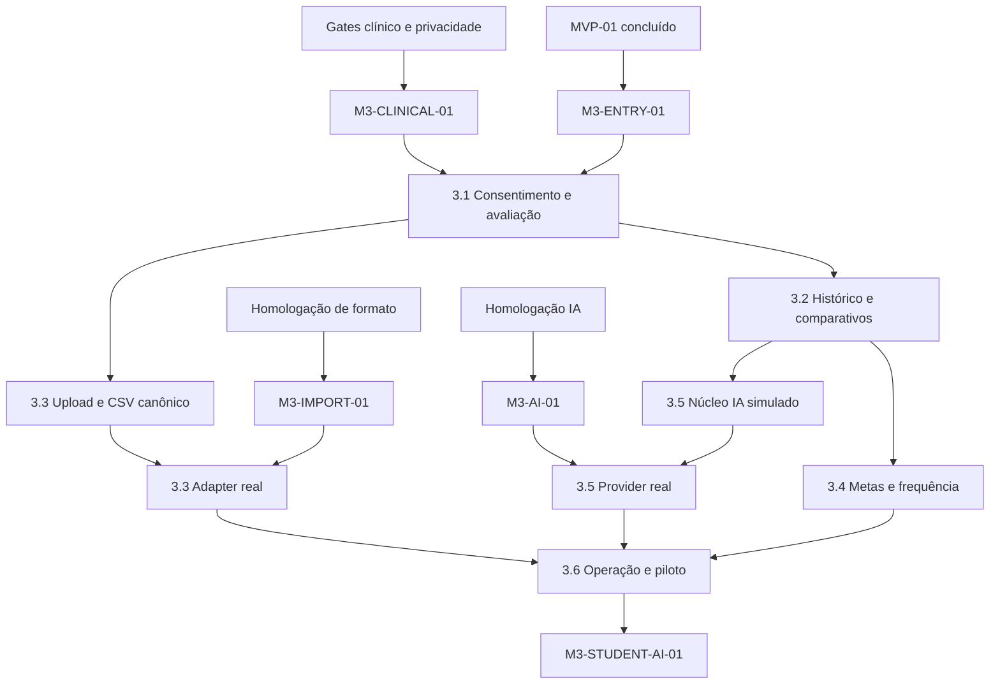

# MVP 03 Health Intelligence Implementation Plan

> **For agentic workers:** REQUIRED SUB-SKILL: Use superpowers:subagent-driven-development (recommended) or superpowers:executing-plans to implement this plan task-by-task. Steps use checkbox (`- [ ]`) syntax for tracking.

**Goal:** Entregar avaliações corporais consentidas, imutáveis e comparáveis, importação revisada, metas/frequência rastreáveis e análise assistiva sem diagnóstico.

**Architecture:** O módulo Health entra no monólito NestJS com PostgreSQL/Prisma e storage privado. Medidas usam decimal fixo e unidades canônicas versionadas. Avaliação publicada é append-only; correções criam revisões. Upload/OCR e IA executam em workers atrás de portas, com simuladores antes dos adapters reais. A autorização combina tenant, papel, vínculo profissional e titularidade do aluno.

**Tech Stack:** Node.js 24.15.0, TypeScript 5.9.3, NestJS 11.2.0, Prisma 7.9.1/PostgreSQL 17 `numeric(18,6)`, Redis/BullMQ, MinIO/S3 privado, Zod 4.4.3, Next.js 16.3.1/React 19.2.8, Jest/Vitest/Playwright/Testcontainers.

---

## 1. Estado e gates

O repositório ainda contém planos, não a implementação dos MVPs anteriores. Este pacote não deve ser executado sobre schemas presumidos.

### `M3-ENTRY-01` — identidade e frequência estáveis

Antes da Slice 3.1:

- [ ] MVP-01 concluído com aluno, consentimento, RBAC, audit, storage, access events e passage estáveis;
- [ ] eventos físicos distinguem `ALLOW` de passagem `CONFIRMED` por hardware/unidade;
- [ ] vínculo profissional-aluno e visão do próprio aluno possuem contrato real ou serão criados na 3.1;
- [ ] comandos raiz estão verdes no commit-base;
- [ ] divergências entre código real e planos anteriores foram refletidas neste pacote.

MVP-02 não é dependência funcional do Health Intelligence.

### `M3-CLINICAL-01` — protocolo e privacidade

Antes de publicar qualquer avaliação:

- [ ] termo de saúde, finalidade, retenção, revogação e exportação aprovados;
- [ ] matriz papel×vínculo×ação aprovada;
- [ ] profissional habilitado assinou tipos, unidades canônicas, conversões, faixas apenas de validação e métricas derivadas;
- [ ] política afirma explicitamente que ausência não é zero e que o sistema não diagnostica/prescreve;
- [ ] manifest `docs/operations/health/health-protocol.json` valida contra schema e tem versão/hash;
- [ ] dados sintéticos/anonimizados são usados em testes.

### `M3-IMPORT-01` — formato, equipamento e malware

Antes de importar um formato real:

- [ ] formato/modelo/firmware/export version inventariado;
- [ ] golden files anonimizados e resultados esperados aprovados;
- [ ] scanner antimalware e política de quarentena homologados;
- [ ] parser/extração possui plano fixo `2026-08-14-mvp-03-import-adapter.md` quando não for o CSV canônico ArenaHub;
- [ ] retenção/deleção verificável dos temporários aprovada.

Formato desconhecido permanece `UNSUPPORTED`; ingestão direta de equipamento não homologado é proibida.

### `M3-AI-01` — provedor/modelo de IA

Antes de chamada real:

- [ ] finalidade/base legal/minimização e DPA aprovados;
- [ ] provedor não usa dados para treinamento sem contrato explícito;
- [ ] região, retenção, deleção, suboperadores, incidentes e custos aprovados;
- [ ] modelo/versionamento, structured output, timeout e limites de dados comprovados;
- [ ] plano `2026-08-14-mvp-03-ai-provider-adapter.md` contém SDK/API real e testes;
- [ ] suite antidiagnóstico/grounding passa no simulador e no provider.

### `M3-STUDENT-AI-01` — publicação para aluno

`HEALTH_AI` inicia em revisão interna. Visibilidade ao aluno exige amostra auditada, zero saída diagnóstica/grounding inválido, aprovação Jurídica/Privacidade e profissional, aviso persistente e canal humano.

## 2. Ordem de execução



| Ordem | Plano | Saída verificável | Gate |
|---|---|---|---|
| 0 | [Gates clínicos, importação e IA](./2026-08-14-mvp-03-00-health-gates.md) | manifests/ADRs e planos de adapters reais | pode avançar como trabalho documental |
| 1 | [3.1 Avaliação manual](./2026-08-14-mvp-03-01-manual-assessments.md) | publicação imutável com proveniência e correção vinculada | `M3-ENTRY-01`, `M3-CLINICAL-01` |
| 2 | [3.2 Histórico e comparativos](./2026-08-14-mvp-03-02-history-comparisons.md) | primeira/anterior/atual/meta determinísticos e exportáveis | 3.1 |
| 3 | [3.3 Upload e revisão](./2026-08-14-mvp-03-03-import-review.md) | extração corrigida por humano antes de virar draft | 3.1; real exige `M3-IMPORT-01` |
| 4 | [3.4 Metas e frequência](./2026-08-14-mvp-03-04-goals-attendance.md) | meta e sessões derivadas sem apagar evento bruto | 3.2 e access events estáveis |
| 5 | [3.5 IA assistiva](./2026-08-14-mvp-03-05-assisted-ai.md) | saída estruturada grounded, revisada e não diagnóstica | 3.2; real exige `M3-AI-01` |
| 6 | [3.6 Operação e qualidade](./2026-08-14-mvp-03-06-operations-quality.md) | falhas corrigíveis sem SQL e piloto aprovado | 3.1–3.5 |

## 3. Decisões vinculantes

### 3.1 Decimal, unidades e ausência

- domínio usa `FixedDecimal` com escala 6 e `bigint`; transporte usa string canônica;
- banco usa `Decimal @db.Decimal(18,6)` com precisão/escala explícitas;
- cada medida guarda valor/unidade original e valor/unidade canônica;
- conversões usam fatores racionais do protocol manifest, nunca `number`;
- cálculo usa precisão armazenada; arredondamento half-up ocorre somente em apresentação/export configurado;
- valor ausente é ausência de linha/`null` com razão; nunca `0` implícito;
- BMI deriva de peso/altura válidos, preserva IDs/valores de entrada e não classifica estado clínico.

```ts
export interface MeasurementValue {
  originalValue: string;
  originalUnit: string;
  canonicalValue: string;
  canonicalUnit: string;
  scale: 6;
}
```

### 3.2 Imutabilidade e proveniência

- avaliação DRAFT pode mudar sob optimistic version;
- publicação valida consentimento, protocolo, vínculo, campos, unidades e proveniência em transação Serializable;
- linhas publicadas não têm update/delete pela role da aplicação;
- correção cria nova avaliação com `supersedesAssessmentId`; original permanece consultável;
- toda medida oficial registra source `MANUAL|CSV|OCR|DEVICE_IMPORT`, responsible actor, assessedAt, protocol version e source reference;
- OCR/IA cria imported fields/review, jamais Assessment PUBLISHED diretamente.

### 3.3 Autorização de saúde

- `HealthAccessContext` inclui tenant, actor, role, student, vínculo e finalidade;
- aluno lê apenas dados próprios; avaliador/personal lê somente vínculo ativo quando exigido;
- operador de importação revisa campos, mas publicação exige `health_assessment.create` e vínculo;
- gerente recebe agregado com mínimo de cinco alunos e nenhuma linha individual;
- Super Admin não recebe conteúdo de saúde por elevação técnica comum; acesso excepcional exige fluxo/justificativa específico e auditado;
- cada leitura, export, correção e análise registra audit sem valores sensíveis em logs gerais.

### 3.4 Upload e adapters

- browser envia direto a object storage privado por URL curta e chave tenant/student gerada pela API;
- upload completa em `QUARANTINED`; scanner aprovado precede parser/OCR;
- MIME declarado nunca basta: magic bytes/tamanho/hash são verificados;
- workers BullMQ processam por import ID; request HTTP não executa OCR/parser pesado;
- `CanonicalCsvParser`, `DocumentExtractor` e `MalwareScanner` são portas; fake/simulador não contam como homologação;
- temporários são deletados com recibo/hash após confirmação/rejeição/retention.

### 3.5 Frequência

- fonte elegível é passagem CONFIRMED quando o hardware fornece confirmação confiável;
- ALLOW sem passagem não conta nessa unidade; limitação é visível;
- deduplicação agrupa eventos numa janela versionada por aluno/unidade, mantendo todos os eventos brutos;
- sessão não infere duração sem evento de saída confiável;
- reprocessamento é idempotente por policy version e high-water mark.

### 3.6 IA assistiva

- `AIProvider` recebe snapshot pseudonimizado estruturado, nunca arquivos/raw OCR/instruções do aluno;
- snapshot, consent version, protocol, prompt/model/schema versions, request hash, custo e latência são persistidos;
- saída Zod deve respeitar `HealthAnalysisOutput` e referenciar apenas métricas/tendências existentes;
- diagnóstico, prescrição, valor inexistente, schema inválido ou disclaimer incorreto gera REJECTED e audit;
- saída válida fica `REVIEW_REQUIRED`; humano aprova/rejeita/regenera com motivo;
- aviso `NOT_MEDICAL_DIAGNOSIS` é renderizado pela aplicação, não confiado ao modelo;
- timeout, budget, concurrency e circuit breaker isolam IA; avaliação manual nunca depende dela.

## 4. Ownership

```text
packages/quantities/                         decimal fixo, unidades e comparações
packages/health-domain/                      comparações, metas, frequência e qualidade
packages/health-import/                      parser canônico e contratos de importação
packages/health-ai/                          contrato, grounding e policy de IA
packages/observability/                      telemetria sem dados clínicos
packages/contracts/src/health/              DTOs, eventos e schemas IA/import
apps/api/src/modules/health-consents/        consentimento específico
apps/api/src/modules/health-access/          papel, vínculo e titularidade
apps/api/src/modules/assessments/            draft, publicação, revisão e medidas
apps/api/src/modules/health-progress/        séries, comparativos e export
apps/api/src/modules/assessment-imports/     upload, scan, parser, OCR e review
apps/api/src/modules/health-goals/            metas/progresso
apps/api/src/modules/attendance/              sessões derivadas
apps/api/src/modules/health-ai/               snapshot, provider, policy e review
apps/api/src/modules/health-operations/       qualidade, alertas e agregados
apps/api/src/workers/health-*                 workers independentes da UI
apps/admin-web/app/(protected)/health/        experiência profissional
apps/admin-web/app/(protected)/my-health/     visão do aluno sob flag
docs/operations/health/                       protocolos, adapters, runbooks/evidências
```

## 5. Matriz completa de requisitos

| Plano | Requisitos cobertos | Evidência |
|---|---|---|
| 3.1 | `M3-FR-001`, `M3-FR-002`, `M3-FR-003`, `M3-FR-004`, `M3-FR-005`, `M3-FR-006`; `M3-BR-001`, `M3-BR-002`, `M3-BR-003`, `M3-BR-004`, `M3-BR-005`; `M3-NFR-001`, `M3-NFR-006`, `M3-NFR-008`; `M3-AC-001`, `M3-AC-002`, `M3-AC-004`, `M3-AC-009` | protocol/decimal tests, DB immutability, consent/vínculo E2E |
| 3.2 | `M3-FR-007`, `M3-FR-008`, `M3-FR-017`; `M3-BR-002`, `M3-BR-003`, `M3-BR-005`; `M3-NFR-001`, `M3-NFR-002`, `M3-NFR-006`, `M3-NFR-007`, `M3-NFR-008`; `M3-AC-003`, `M3-AC-004`, `M3-AC-010` | golden comparisons, accessible chart/table, perf/export |
| 3.3 | `M3-FR-009`, `M3-FR-010`, `M3-FR-011`, `M3-FR-014`; `M3-BR-002`, `M3-BR-004`, `M3-BR-005`, `M3-BR-006`; `M3-NFR-003`, `M3-NFR-004`, `M3-NFR-006`, `M3-NFR-008`; `M3-AC-004`, `M3-AC-005` | malware/golden parser, field review, delete receipt |
| 3.4 | `M3-FR-012`, `M3-FR-013`, `M3-FR-014`; `M3-BR-007`, `M3-BR-008`; `M3-NFR-001`, `M3-NFR-002`, `M3-NFR-006`; `M3-AC-006` | goal properties, event high-water/dedup fixtures |
| 3.5 | `M3-FR-015`, `M3-FR-016`; `M3-BR-004`, `M3-BR-009`, `M3-BR-010`; `M3-NFR-004`, `M3-NFR-005`, `M3-NFR-006`; `M3-AC-007`, `M3-AC-008` | structured output, grounding/diagnosis suite, timeout/budget |
| 3.6 | requisitos transversais; `M3-NFR-007`, `M3-NFR-008`; `M3-AC-001`–`M3-AC-010` | dashboard, runbooks, privacy drills e piloto |

Cobertura esperada: 17 FR, 10 BR, 8 NFR e 10 AC.

## 6. Gate final e execução

Comandos por slice:

```bash
pnpm install --frozen-lockfile
pnpm lint
pnpm typecheck
pnpm test
pnpm test:integration
pnpm test:e2e
pnpm build
```

Gate de saída:

- [ ] todas as medidas oficiais têm unidade/origem/responsável/data/protocolo;
- [ ] avaliação publicada não foi alterada por update/delete;
- [ ] nenhum import/OCR/IA publica sem confirmação humana;
- [ ] tenant, papel, vínculo, titularidade e consentimento têm abuso tests;
- [ ] comparativos/gráficos/export são determinísticos e acessíveis;
- [ ] frequência preserva eventos e expõe limitações;
- [ ] IA real passa privacy, schema, grounding, diagnóstico, timeout e budget;
- [ ] piloto profissional e visão do aluno sob flags aprovados;
- [ ] PRD só muda para `CONCLUÍDO` com evidência assinada.

## 7. Opções de execução

1. **Subagent-Driven (recomendado):** gate/protocolo e cada slice em execução separada.
2. **Inline:** executar sequencialmente, parando nos gates de importação, IA e publicação ao aluno.

O primeiro trabalho seguro é `2026-08-14-mvp-03-00-health-gates.md`; código começa após `M3-ENTRY-01` e `M3-CLINICAL-01`.
