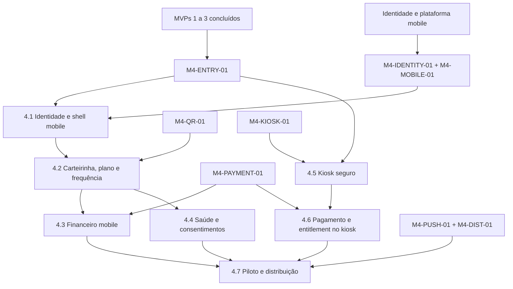

# MVP-04 — App do aluno e Totem Implementation Plan

> **For agentic workers:** REQUIRED SUB-SKILL: Use superpowers:subagent-driven-development (recommended) or superpowers:executing-plans to implement this plan task-by-task. Steps use checkbox (`- [ ]`) syntax for tracking.

**Goal:** Entregar autosserviço mobile e kiosk seguro para identidade, carteirinha, situação, frequência, saúde e pagamentos sem duplicar regras dos MVPs 1 a 3.

**Architecture:** `apps/mobile` é um cliente Expo autenticado, sem cache persistente de dados sensíveis; `apps/kiosk` é uma PWA Next.js com identidade própria de dispositivo e sessão de aluno curta em cookies `HttpOnly`. Endpoints mobile/kiosk formam BFFs lógicos dentro da API NestJS e dependem de portas públicas dos módulos existentes, nunca de suas tabelas. Hardware, QR, push, checkout e distribuição real permanecem bloqueados até seus manifests de gate serem aprovados.

**Tech Stack:** Node.js 24.15.0, TypeScript 5.9.3, NestJS 11.2.0, Prisma 7.9.1/PostgreSQL 17, Redis/BullMQ, Expo/React Native/Expo Router fixados por manifesto, Next.js 16.3.1/React 19.2.8 PWA, Zod 4.4.3, Jest, Vitest, Testing Library, Playwright e runner mobile homologado.

---

## 1. Estado e gates

O repositório contém os planos, não a implementação dos MVPs 1 a 3. Nenhuma slice de código do MVP-04 começa sobre contratos presumidos.

### `M4-ENTRY-01` — APIs anteriores estáveis

- [ ] MVPs 1, 2 e 3 concluídos no commit-base;
- [ ] OpenAPI versionada contém identidade, membership, access/frequency, invoices/payments e health/export;
- [ ] testes de contrato dos consumidores passam contra a API real;
- [ ] nenhum BFF precisa consultar tabela privada de outro módulo;
- [ ] comandos raiz estão verdes.

### `M4-IDENTITY-01` — ativação e recuperação

- [ ] canal de entrega de convite/recuperação aprovado;
- [ ] validade, uso único, rate limit, enumeração e suporte aprovados;
- [ ] política de senha e step-up definida;
- [ ] CPF no kiosk possui segundo fator aprovado;
- [ ] recepção auxilia sem ver senha, token ou assumir sessão.

### `M4-MOBILE-01` — plataforma mobile

- [ ] versões compatíveis de Expo SDK, React Native, Expo Router, SecureStore e Notifications registradas em manifesto;
- [ ] Android/iOS de referência e runner E2E homologados;
- [ ] schemes, universal/app links e domínios aprovados;
- [ ] política de chaves, builds, updates e rollback aprovada;
- [ ] dependências de runtime autorizadas.

### `M4-QR-01` — credencial rotativa

- [ ] leitor/catraca e caminho de validação inventariados;
- [ ] assinatura, rotação, consumo, relógio e replay testados;
- [ ] política online/offline documentada;
- [ ] unidade sem proteção de replay mantém a feature desabilitada.

### `M4-KIOSK-01` — dispositivo público

- [ ] hardware, SO, navegador, leitor, câmera, impressora e rede inventariados;
- [ ] usuário restrito, allowlist, autofill/devtools/download/clipboard/print definidos;
- [ ] provisionamento, rotação de credencial, remote health e restore testados;
- [ ] threat model e teste A→B aprovados.

### `M4-PAYMENT-01` — canais de pagamento

- [ ] endpoints públicos do MVP-02 e chaves idempotentes estabilizados;
- [ ] hosted checkout, return URLs e hosts permitidos homologados;
- [ ] sandbox cobre webhook ausente, atraso, duplicata e retorno adulterado;
- [ ] nenhum dado completo de cartão atravessa ArenaHub.

### `M4-PUSH-01` e `M4-DIST-01` — push e distribuição

- [ ] provider de push, retenção, conteúdo mínimo e consentimento aprovados;
- [ ] contas de loja, assinatura, privacy labels, suporte e crash provider aprovados;
- [ ] versão mínima, período de tolerância e rollback definidos;
- [ ] falha de `M4-PUSH-01` transfere push externo para a Slice 5.5 sem dispensar notificações internas.

## 2. Ordem de execução



| Ordem | Plano | Saída verificável | Gate |
|---|---|---|---|
| 0 | [Gates de canais](./2026-08-14-mvp-04-00-channel-gates.md) | manifests, inventories, ADRs e planos de adapter | documental |
| 1 | [4.1 Identidade e shell mobile](./2026-08-14-mvp-04-01-mobile-identity-shell.md) | ativação, refresh rotativo, sessões e Home mínima | `M4-ENTRY-01`, `M4-IDENTITY-01`, `M4-MOBILE-01` |
| 2 | [4.2 Carteirinha, plano e frequência](./2026-08-14-mvp-04-02-card-membership-attendance.md) | situação própria e QR consumível | 4.1; QR real exige `M4-QR-01` |
| 3 | [4.3 Financeiro mobile](./2026-08-14-mvp-04-03-mobile-billing.md) | invoices, PIX, checkout e recibo sem dupla cobrança | 4.1; `M4-PAYMENT-01` |
| 4 | [4.4 Saúde e consentimentos](./2026-08-14-mvp-04-04-health-consents.md) | histórico publicado, IA aprovada, export e consentimentos | 4.1; MVP-03 estável |
| 5 | [4.5 Kiosk seguro](./2026-08-14-mvp-04-05-secure-kiosk.md) | provisionamento e sessão A→B limpa | `M4-ENTRY-01`, `M4-KIOSK-01` |
| 6 | [4.6 Pagamento e entitlement no kiosk](./2026-08-14-mvp-04-06-kiosk-payment-entitlement.md) | pagamento confirmado pelo backend restaura entitlement | 4.5; `M4-PAYMENT-01` |
| 7 | [4.7 Piloto e distribuição](./2026-08-14-mvp-04-07-pilot-distribution.md) | builds, versão mínima, operação e rollout aprovado | 4.1–4.6; `M4-DIST-01` |

## 3. Decisões vinculantes

### 3.1 Fronteiras dos canais

- mobile e kiosk expõem DTOs próprios em `/api/v1/mobile` e `/api/v1/kiosk`;
- DTO de canal não reutiliza entidade Prisma ou DTO administrativo;
- `StudentChannelContext` deriva tenant, aluno, canal, sessão e device do token/cookie autenticado;
- BFFs chamam portas de membership, invoices, payments, attendance e health;
- resposta agrega `asOf`, `status: AVAILABLE|UNAVAILABLE|STALE` e ação possível por seção;
- app e kiosk nunca recalculam estado financeiro, acesso, saúde ou entitlement.

```ts
export interface StudentChannelContext {
  tenantId: string;
  studentId: string;
  sessionId: string;
  channel: 'MOBILE' | 'KIOSK';
  deviceId: string;
  reauthenticatedAt: string | null;
}
```

### 3.2 Sessão mobile

- access token curto permanece em memória;
- refresh token rotativo fica somente no SecureStore nativo e é persistido como hash no backend;
- AsyncStorage, SQLite, logs, analytics e crash reports não recebem tokens ou payloads sensíveis;
- biometria local pode proteger o SecureStore ou solicitar step-up de interface, mas nunca vira identidade aceita pelo backend;
- refresh replay revoga toda a família;
- logout remove SecureStore e revoga a sessão; revogação remota impede novo refresh;
- AppState em background oculta telas sensíveis e revalida sessão no retorno.

### 3.3 Ativação, recuperação e deep link

- tokens são aleatórios, de uso único, vinculados ao aluno/finalidade e persistidos somente como hash;
- respostas de início são constantes para evitar enumeração;
- deep link usa allowlist de scheme/host/path e nonce/state verificado no backend;
- ativação define credencial sem expô-la à recepção;
- ação sensível exige `reauthenticatedAt` dentro da janela aprovada.

### 3.4 QR da carteirinha

- payload curto contém versão, key ID, expiração e `jti` opaco; nunca nome, CPF ou matrícula;
- assinatura é verificável pelo validador aprovado e chave possui rotação;
- backend guarda hash do `jti` e consumo atômico para bloquear replay;
- relógio e tolerância vêm do manifesto;
- ausência de conectividade/replay controlável desabilita QR naquela unidade em vez de reduzir segurança silenciosamente.

### 3.5 Kiosk

- dispositivo possui credencial persistente própria, sem PII, em cookie `HttpOnly; Secure; SameSite=Strict` ou mecanismo superior aprovado no gate;
- kiosk e API devem compartilhar o mesmo site registrável, com origins e CORS em allowlist exata; topologia incompatível bloqueia o deploy;
- sessão do aluno usa cookie separado, curta e vinculada ao dispositivo;
- CPF apenas localiza; QR aprovado ou segundo fator verifica;
- nenhum dado do aluno vai para localStorage, sessionStorage, IndexedDB, Cache API, autofill ou service worker;
- respostas autenticadas usam `Cache-Control: no-store`; PWA precacheia apenas shell público versionado;
- câmera/canvas/object URLs são encerrados e limpos; impressão fica desabilitada salvo fluxo homologado com limpeza de spool;
- timeout, erro, perda de foco e ação explícita encerram no backend e executam limpeza + reload;
- backend TTL é a garantia; JavaScript de inatividade é apenas defesa adicional.

### 3.6 Pagamentos

- mobile/kiosk criam intenção por porta do MVP-02 com `Idempotency-Key` estável;
- retorno visual, deep link ou mensagem da WebView nunca confirma pagamento;
- status vem da projeção confirmada por webhook/polling do backend;
- checkout aceita somente URL emitida pelo backend e hosts homologados;
- contexto do app pode ser retomado por `paymentAttemptId` opaco; não por parâmetros financeiros do redirect;
- kiosk encerra/anonimiza a sessão após transferir acompanhamento para QR no celular quando aplicável.

### 3.7 Cache, privacidade e telemetria

- app não persiste dados de aluno; em indisponibilidade mostra shell genérico e novo fetch;
- notificações internas são lidas da API; push externo contém texto mínimo e deep link opaco;
- push token é cifrado em repouso e possui hash para idempotência;
- eventos de crash/jornada usam códigos, versão e trace ID; não contêm PII, saúde, invoice, QR, token ou checkout URL;
- feature flags fecham por padrão e gates documentais continuam obrigatórios.

## 4. Ownership

```text
apps/mobile/                                  Expo Router, sessão e jornadas do aluno
apps/kiosk/                                   Next.js PWA, shell público e sessão efêmera
apps/api/src/modules/student-identity/        ativação, recuperação e sessão mobile
apps/api/src/modules/student-mobile/          Home e DTOs agregados por portas
apps/api/src/modules/student-credentials/     QR rotativo e consumo
apps/api/src/modules/student-notifications/   inbox e push opt-in
apps/api/src/modules/kiosk-devices/           provisionamento, credencial e heartbeat
apps/api/src/modules/kiosk-sessions/          identificação, TTL, limpeza e auditoria
apps/api/src/modules/kiosk-bff/               resumo e comandos mínimos do kiosk
apps/api/src/workers/student-channels-*        push, expiração e projeções assíncronas
packages/contracts/src/student-channels/      schemas internos, eventos e erros
packages/api-contracts/                       cliente gerado do OpenAPI por canal
packages/database/prisma/                     modelos e migrations aditivas
docs/operations/app-totem/                    manifests, runbooks e evidências
```

## 5. Eventos estáveis

Todos usam o envelope transversal e `schemaVersion: 1`:

```text
StudentAccountActivated
StudentSessionCreated
StudentSessionRevoked
MobileDeviceRegistered
RotatingQrIssued
RotatingQrConsumed
KioskDeviceProvisioned
KioskSessionStarted
KioskSessionEnded
PushSubscriptionChanged
```

Eventos não carregam token, QR, senha, CPF, payload de saúde, URL de checkout ou push token.

## 6. Matriz completa de rastreabilidade

| Plano | Requisitos cobertos | Evidência principal |
|---|---|---|
| 4.1 | `M4-FR-001`, `M4-FR-002`, `M4-FR-003`, `M4-FR-004`, `M4-FR-005`; `M4-NFR-002`, `M4-NFR-006`, `M4-NFR-007`, `M4-NFR-008`; `M4-AC-001`, `M4-AC-002` | activation abuse, refresh replay, SecureStore e sessão revogada |
| 4.2 | `M4-FR-006`, `M4-FR-007`, `M4-FR-008`; `M4-BR-002`, `M4-BR-003`, `M4-BR-008`; `M4-NFR-001`, `M4-NFR-002`, `M4-NFR-005`, `M4-NFR-006`, `M4-NFR-007`; `M4-AC-003`, `M4-AC-004` | contrato Home, QR golden/replay e acessibilidade |
| 4.3 | `M4-FR-009`, `M4-FR-010`, `M4-FR-011`; `M4-BR-001`, `M4-BR-008`; `M4-NFR-001`, `M4-NFR-002`, `M4-NFR-006`, `M4-NFR-007`; `M4-AC-004`, `M4-AC-005`, `M4-AC-006` | idempotência, redirect hostil e confirmação backend |
| 4.4 | `M4-FR-012`, `M4-FR-013`; `M4-BR-008`, `M4-BR-009`; `M4-NFR-001`, `M4-NFR-002`, `M4-NFR-006`, `M4-NFR-007`; `M4-AC-004` | histórico próprio, IA aprovada, export e revogação |
| 4.5 | `M4-FR-015`, `M4-FR-016`, `M4-FR-017`, `M4-FR-018`, `M4-FR-019`, `M4-FR-020`, `M4-FR-022`; `M4-BR-004`, `M4-BR-005`, `M4-BR-006`, `M4-BR-007`; `M4-NFR-004`, `M4-NFR-006`, `M4-NFR-007`, `M4-NFR-008`; `M4-AC-007`, `M4-AC-008`, `M4-AC-010` | provisionamento, autorização e bateria A→B |
| 4.6 | `M4-FR-021`; `M4-BR-001`, `M4-BR-007`, `M4-BR-008`; `M4-NFR-004`, `M4-NFR-006`, `M4-NFR-007`; `M4-AC-005`, `M4-AC-006`, `M4-AC-009` | PIX/checkout idempotente e entitlement por evento |
| 4.7 | `M4-FR-014`, requisitos transversais; `M4-NFR-001`, `M4-NFR-002`, `M4-NFR-003`, `M4-NFR-004`, `M4-NFR-005`, `M4-NFR-006`, `M4-NFR-007`, `M4-NFR-008`; `M4-AC-001`, `M4-AC-002`, `M4-AC-003`, `M4-AC-004`, `M4-AC-005`, `M4-AC-006`, `M4-AC-007`, `M4-AC-008`, `M4-AC-009`, `M4-AC-010`, `M4-AC-011` | push opt-in, builds, SLOs, crash-free, rollback e piloto |

Cobertura esperada: 22 FR, 9 BR, 8 NFR e 11 AC.

## 7. Gate final

- [ ] app não persiste dados sensíveis fora do SecureStore dedicado ao refresh;
- [ ] sessão revogada não renova e refresh replay revoga a família;
- [ ] QR expirado, adulterado ou consumido é recusado;
- [ ] cliente não decide membership, pagamento, entitlement, frequência ou saúde;
- [ ] retorno de checkout sem confirmação backend não altera estado;
- [ ] kiosk não autentica apenas com CPF;
- [ ] bateria A→B encontra zero dado residual visual, storage, cache, autofill ou impressão;
- [ ] Home e kiosk cumprem SLOs aprovados;
- [ ] crash/telemetria não contêm PII;
- [ ] piloto e rollback são assinados antes do rollout geral.

## 8. Opções de execução

1. **Subagent-Driven (recomendado):** gates e cada slice em execução isolada, com revisão entre contratos.
2. **Inline:** executar sequencialmente e interromper apenas nos gates de plataforma, hardware, pagamento e distribuição.

O primeiro trabalho seguro é `2026-08-14-mvp-04-00-channel-gates.md`; código começa após `M4-ENTRY-01` e os gates específicos da slice.
