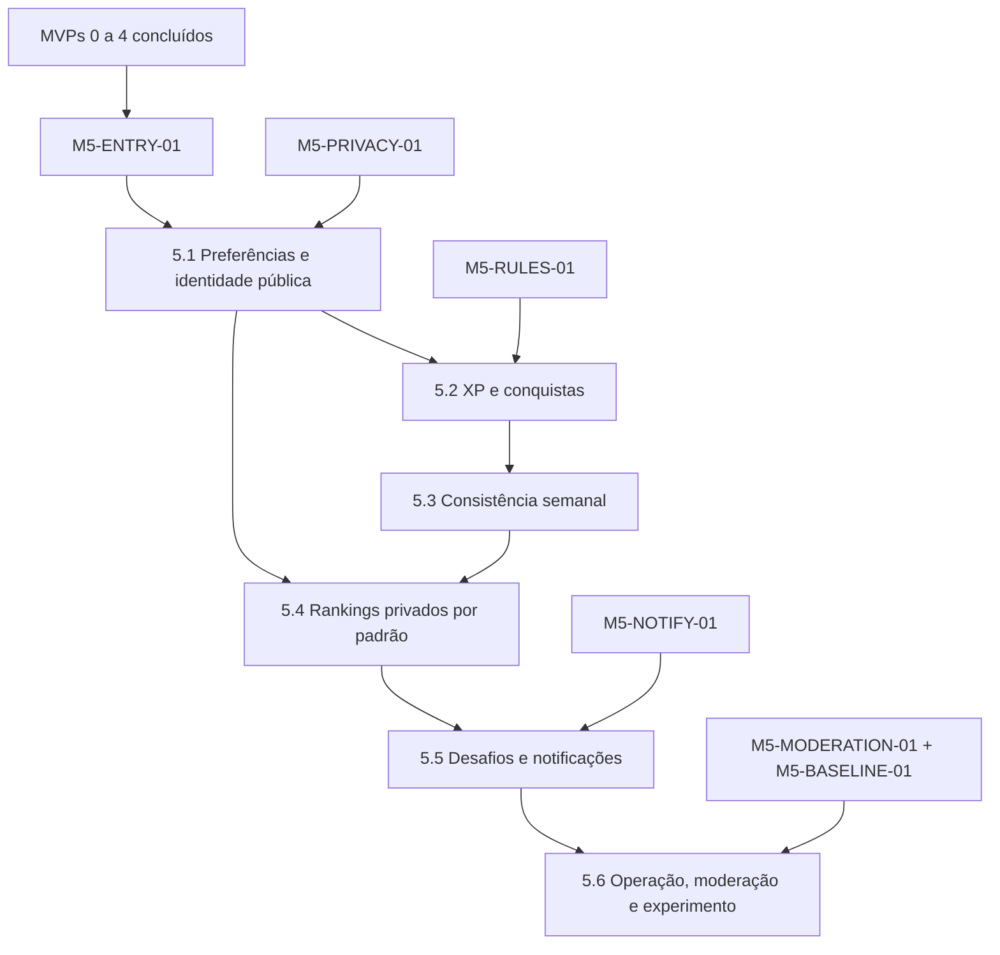

# MVP-05 — Engajamento responsável Implementation Plan

> **For agentic workers:** REQUIRED SUB-SKILL: Use superpowers:subagent-driven-development (recommended) or superpowers:executing-plans to implement this plan task-by-task. Steps use checkbox (`- [ ]`) syntax for tracking.

**Goal:** Entregar XP privado, conquistas, consistência semanal, rankings opt-in e desafios seguros, com consentimento revogável, regras versionadas e operação auditável.

**Architecture:** O domínio de engagement consome eventos confirmados dos MVPs anteriores por inbox idempotente e mantém ledger append-only. XP, streaks e progresso são projeções reconstruíveis; rankings publicados são snapshots imutáveis com uma projeção pública que aplica o consentimento atual em tempo de leitura. App e admin apenas renderizam decisões do backend. Notificações reutilizam o módulo do MVP-04 e BullMQ apenas orquestra trabalho; unicidade e auditoria permanecem no PostgreSQL.

**Tech Stack:** Node.js 24.15.0, TypeScript 5.9.3, NestJS 11.2.0, Prisma 7.9.1/PostgreSQL 17, Redis/BullMQ, Expo/React Native/Expo Router conforme manifesto do MVP-04, Next.js 16.3.1/React 19.2.8, Zod 4.4.3, Jest, Vitest, Testing Library, Playwright e Testcontainers.

---

## 1. Risco central e gates

O repositório contém planos, não a implementação dos MVPs anteriores. Nenhuma slice do MVP-05 começa sobre eventos, consentimentos ou limites presumidos.

### `M5-ENTRY-01` — dependências estáveis

- [ ] MVP-04 concluído no commit-base e app disponível no tenant piloto;
- [ ] `PassageConfirmed`, `AssessmentPublished`, `HealthGoalReached`, `SubscriptionPaused` e `SubscriptionActivated` publicados pelo outbox real;
- [ ] contrato de sessão elegível e deduplicação de passagem aprovado;
- [ ] testes de contrato passam sem consulta a tabelas privadas upstream.

### `M5-PRIVACY-01` — consentimento e identidade pública

- [ ] opt-ins independentes para rankings, desafios, push de engagement e métricas de evolução física;
- [ ] nenhum opt-in marcado por padrão, herdado ou agregado em aceite genérico;
- [ ] identidade pública, pseudônimo por snapshot e política de remoção aprovados;
- [ ] opt-out aplicado à leitura pública e caches em até 15 minutos.

### `M5-RULES-01` — catálogos e limites

- [ ] catálogo versionado de XP, conquistas, streaks, rankings e desafios aprovado;
- [ ] profissional responsável aprovou frequência, pausas, comparabilidade e limites de desafio;
- [ ] nenhuma regra premia passagens repetidas no mesmo dia local;
- [ ] interpretador declarativo não aceita JavaScript, SQL ou expressão arbitrária.

### `M5-MODERATION-01` — operação e recurso

- [ ] política de alias, sinalização, ocultação, disputa, recurso e correção aprovada;
- [ ] permissões e justificativas de operador definidas;
- [ ] correções usam movimento compensatório ou nova revisão, sem `UPDATE` destrutivo;
- [ ] padrões impossíveis geram revisão, nunca punição automática.

### `M5-NOTIFY-01` e `M5-BASELINE-01`

- [ ] inbox interna do MVP-04 está estável;
- [ ] push possui provider aprovado ou continua fechado por flag;
- [ ] quiet hours, orçamento por aluno/campanha e expiração de mensagem aprovados;
- [ ] baseline, grupos, métricas adversas, parada e rollback do piloto aprovados.

## 2. Ordem de execução



| Ordem | Plano | Saída verificável | Gate |
|---|---|---|---|
| 0 | [Gates e políticas](./2026-08-14-mvp-05-00-engagement-gates.md) | manifests assinados, baseline e contratos reais | documental |
| 1 | [5.1 Preferências e identidade pública](./2026-08-14-mvp-05-01-preferences-public-identity.md) | opt-ins separados, alias moderado e opt-out fail-safe | `M5-ENTRY-01`, `M5-PRIVACY-01` |
| 2 | [5.2 XP e conquistas](./2026-08-14-mvp-05-02-xp-achievements.md) | ledger append-only, regras versionadas e replay seguro | 5.1; `M5-RULES-01` |
| 3 | [5.3 Consistência semanal](./2026-08-14-mvp-05-03-consistency-streak.md) | streak semanal reconstruível com pausas aprovadas | 5.2; `M5-RULES-01` |
| 4 | [5.4 Rankings privados por padrão](./2026-08-14-mvp-05-04-private-rankings.md) | snapshots imutáveis e projeção pública consentida | 5.1–5.3; `M5-PRIVACY-01` |
| 5 | [5.5 Desafios e notificações](./2026-08-14-mvp-05-05-challenges-notifications.md) | templates seguros, adesão independente e orçamento de contato | 5.1–5.4; `M5-NOTIFY-01` |
| 6 | [5.6 Operação, moderação e experimento](./2026-08-14-mvp-05-06-operations-experiment.md) | disputas, correções, métricas adversas, rollout e rollback | 5.1–5.5; `M5-MODERATION-01`, `M5-BASELINE-01` |

## 3. Decisões vinculantes

### 3.1 Consentimento em duas camadas

- `EngagementPreferences` controla adesão explícita por finalidade;
- ranking de evolução física exige consentimento específico além do opt-in de ranking;
- materialização filtra consentimento antes de criar entradas;
- API pública reaplica o consentimento atual e tombstones para impedir exposição durante a janela de reconstrução;
- snapshot bruto permanece imutável e restrito à auditoria; a projeção pública pode ocultar entrada sem reescrever o histórico;
- opt-out invalida cache, cancela contato pendente e solicita revisão do snapshot em até 15 minutos;
- recusar ranking não altera XP privado, acesso, cobrança, saúde ou demais recursos do app.

### 3.2 Ledger, eventos e reconstrução

```ts
export interface EngagementSourceRef {
  tenantId: string;
  studentId: string;
  sourceEventId: string;
  sourceEventType: string;
  occurredAt: string;
  unitTimezone: string;
}

export type XpMovementType = 'GRANT' | 'ADJUSTMENT' | 'REVERSAL';
```

- inbox e ledger possuem unicidade transacional por tenant, aluno, evento e versão de regra;
- deduplicação do BullMQ reduz trabalho, mas não é garantia de negócio;
- replay de 100 mensagens produz um único movimento;
- saldo, conquistas, streak e progresso podem ser reconstruídos a partir do ledger/inbox;
- nova versão vale a partir de `effectiveAt`; não reescreve movimento ou snapshot passado;
- correção cria movimento compensatório com motivo, ator e vínculo ao original;
- XP não tem valor monetário, não expira silenciosamente e não é transferível.

### 3.3 Sessão elegível e consistência

- somente sessão derivada de `PassageConfirmed` pode gerar XP de treino;
- no máximo uma sessão elegível por aluno, unidade e dia local gera recompensa;
- passagem negada, tentativa, evento incompleto ou duplicata não pontua;
- streak é semanal e usa política versionada, nunca sequência diária ilimitada;
- pausa aprovada preserva ou suspende a contagem conforme política publicada;
- lesão ou condição médica não é inferida por frequência.

### 3.4 Rankings

- estados: `DRAFT`, `VALIDATED`, `PUBLISHED`, `SUPERSEDED`, `WITHHELD`;
- snapshot fixa tenant, unidade, período, categoria, versão de regra, conjunto elegível e desempate;
- coorte abaixo do mínimo aprovado fica `WITHHELD` sem revelar contagem sensível;
- desempate é determinístico e publicado; sorteio oculto é proibido;
- evolução física usa somente variação relativa com baseline comparável e jamais expõe valor absoluto;
- alias usa perfil público aprovado ou pseudônimo estável apenas dentro do snapshot;
- resposta p95 inferior a 500 ms vem de projeção publicada, sem cálculo pesado síncrono.

### 3.5 Desafios e notificações

- desafio nasce somente de template versionado permitido;
- limite de frequência vem de política assinada por profissional, não de constante inventada no código;
- adesão e saída do desafio são independentes dos demais opt-ins;
- progressão usa a mesma sessão elegível e a mesma deduplicação do XP;
- inbox interna é obrigatória; push depende de consentimento e provider aprovado;
- quiet hours adiam até `notBefore`; mensagens vencidas expiram em vez de causar rajada;
- lock screen não mostra saúde, posição, valor corporal ou dado de terceiro;
- WhatsApp, SMS e campanhas automáticas de retenção permanecem fora do escopo.

### 3.6 Moderação e experimento

- alias sinalizado vai para revisão humana; rejeição informa categoria de motivo e permite recurso;
- disputa congela referências de evidência e resolve por ajuste/revisão, nunca por edição direta;
- atribuição experimental é determinística antes da exposição e analisada por intenção de tratar;
- controle não recebe nudges de engagement;
- aumento de frequência só é sucesso se opt-out, denúncia e sinais de sobreuso não piorarem;
- sinal adverso reduz exposição e abre revisão; não produz diagnóstico ou punição automática.

## 4. Ownership

```text
apps/api/src/modules/engagement-preferences/   opt-ins, perfil público e tombstones
apps/api/src/modules/engagement-rules/         catálogos e interpretador declarativo
apps/api/src/modules/engagement-xp/            inbox, ledger e saldo projetado
apps/api/src/modules/engagement-achievements/  critérios e desbloqueios
apps/api/src/modules/engagement-streaks/       consistência semanal e pausas
apps/api/src/modules/engagement-rankings/      snapshots e projeção pública
apps/api/src/modules/engagement-challenges/    templates, adesão e progresso
apps/api/src/modules/engagement-moderation/    alias, disputas e correções
apps/api/src/modules/engagement-operations/    métricas, experimento e rollout
apps/api/src/workers/engagement-*              projeções e publicações assíncronas
apps/mobile/app/(protected)/engagement/         rotas do aluno
apps/mobile/src/features/engagement/            telas e cliente tipado
apps/admin-web/app/(protected)/engagement/      operação administrativa
apps/admin-web/components/engagement/           componentes administrativos
packages/engagement-domain/                     regras puras e reconstrução
packages/contracts/src/engagement/              eventos internos e schemas
packages/api-contracts/                         cliente OpenAPI gerado
packages/database/prisma/                       modelos e migrations aditivas
docs/operations/engagement/                     manifests, runbooks e evidências
```

`student-notifications` continua dono da inbox e entrega push. Engagement fornece intenção, orçamento e conteúdo mínimo; não cria outro sistema de notificações.

## 5. Eventos estáveis

Consumidos com `schemaVersion: 1`: `PassageConfirmed`, `AssessmentPublished`, `HealthGoalReached`, `SubscriptionPaused`, `SubscriptionActivated`.

Produzidos com outbox transacional e sem PII: `XPGranted`, `XPAdjusted`, `AchievementUnlocked`, `StreakExtended`, `StreakBroken`, `RankingPublished`, `ChallengeJoined`, `ChallengeCompleted`, `EngagementOptedOut`.

Eventos públicos não carregam alias, posição, medida corporal, push token ou conteúdo de disputa.

## 6. Matriz completa de rastreabilidade

| Plano | Requisitos cobertos | Evidência principal |
|---|---|---|
| 5.1 | `M5-FR-001`, `M5-FR-002`, `M5-FR-003`; `M5-BR-001`, `M5-BR-002`, `M5-BR-012`; `M5-NFR-003`, `M5-NFR-007`, `M5-NFR-008`; `M5-AC-001`, `M5-AC-009` | opt-in falso por padrão, perfil moderado e opt-out em leitura/cache |
| 5.2 | `M5-FR-004`, `M5-FR-005`, `M5-FR-006`, `M5-FR-007`; `M5-BR-003`, `M5-BR-004`, `M5-BR-009`, `M5-BR-010`; `M5-NFR-001`, `M5-NFR-002`, `M5-NFR-007`, `M5-NFR-008`; `M5-AC-002`, `M5-AC-003` | replay 100×, ledger append-only e conquista versionada |
| 5.3 | `M5-FR-008`, `M5-FR-009`; `M5-BR-003`, `M5-BR-004`, `M5-BR-005`; `M5-NFR-001`, `M5-NFR-002`, `M5-NFR-007`, `M5-NFR-008`; `M5-AC-003`, `M5-AC-004` | semana local, pausa aprovada e rebuild determinístico |
| 5.4 | `M5-FR-010`, `M5-FR-011`, `M5-FR-012`; `M5-BR-001`, `M5-BR-006`, `M5-BR-007`, `M5-BR-008`, `M5-BR-009`; `M5-NFR-003`, `M5-NFR-004`, `M5-NFR-005`, `M5-NFR-007`, `M5-NFR-008`; `M5-AC-001`, `M5-AC-005`, `M5-AC-006`, `M5-AC-007`, `M5-AC-009` | coorte mínima, snapshot imutável e projeção pública consentida |
| 5.5 | `M5-FR-013`, `M5-FR-014`, `M5-FR-015`; `M5-BR-001`, `M5-BR-011`; `M5-NFR-001`, `M5-NFR-005`, `M5-NFR-006`, `M5-NFR-007`, `M5-NFR-008`; `M5-AC-008` | template seguro, adesão independente, quiet hours e rate limit |
| 5.6 | `M5-FR-016`, `M5-FR-017`, `M5-FR-018`; `M5-BR-009`, `M5-BR-012`; `M5-NFR-001`, `M5-NFR-002`, `M5-NFR-003`, `M5-NFR-004`, `M5-NFR-005`, `M5-NFR-006`, `M5-NFR-007`, `M5-NFR-008`; `M5-AC-001`, `M5-AC-002`, `M5-AC-003`, `M5-AC-004`, `M5-AC-005`, `M5-AC-006`, `M5-AC-007`, `M5-AC-008`, `M5-AC-009`, `M5-AC-010` | disputa auditada, recálculo dry-run, métricas adversas e rollback |

Cobertura esperada: 18 FR, 12 BR, 8 NFR e 10 AC.

## 7. Gate final

- [ ] não participante não aparece em ranking, export, cache, analytics ou notificação pública;
- [ ] replay de evento não duplica XP, conquista, streak ou progresso;
- [ ] duas entradas no mesmo dia local rendem no máximo uma sessão elegível;
- [ ] regra nova não altera ledger ou snapshot histórico;
- [ ] evolução física pública não contém medida absoluta;
- [ ] coorte insuficiente não é publicada;
- [ ] desafio acima do limite profissional é recusado antes da ativação;
- [ ] opt-out remove a exposição e cancela contato dentro do SLO;
- [ ] disputa mantém evidência, ator, motivo e correção compensatória;
- [ ] piloto para quando guardrail adverso aprovado é rompido.

## 8. Opções de execução

1. **Subagent-Driven (recomendado):** executar gates e uma slice por vez, com revisão de contrato e segurança entre slices.
2. **Inline:** executar sequencialmente no mesmo contexto, mantendo os mesmos gates e commits granulares.

O primeiro trabalho seguro é `2026-08-14-mvp-05-00-engagement-gates.md`; código começa somente após `M5-ENTRY-01` e os gates específicos da slice.
