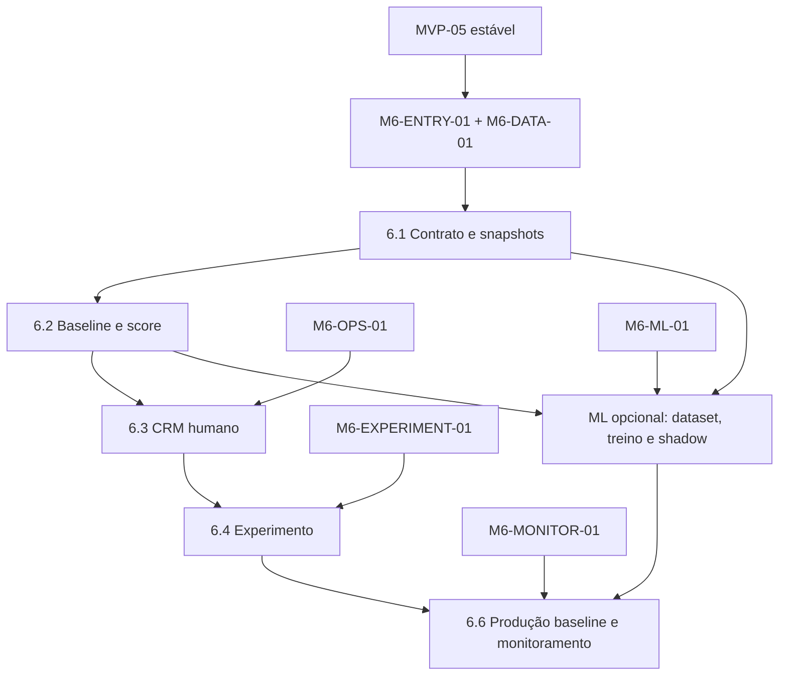

# MVP-06 — Retention AI Implementation Plan

> **For agentic workers:** REQUIRED SUB-SKILL: Use superpowers:subagent-driven-development (recommended) or superpowers:executing-plans to implement this plan task-by-task. Steps use checkbox (`- [ ]`) syntax for tracking.

**Goal:** Converter risco explicável de churn em tarefas humanas priorizadas e resultados mensuráveis, mantendo ML supervisionado opcional e isolado por tenant.

**Architecture:** O núcleo NestJS materializa snapshots point-in-time, executa baseline determinística, aplica elegibilidade/capacidade e opera o CRM. Eventos entram por inbox com `firstReceivedAt`, preservando o que era conhecido na observação. Um pipeline Python batch, sem API e sem acesso direto ao banco operacional, só entra após gate; ele troca datasets e prediction batches checksummed via storage privado. Baseline continua sendo fallback obrigatório.

**Tech Stack:** Node.js 24.15.0, TypeScript 5.9.3, NestJS 11.2.0, Prisma 7.9.1/PostgreSQL 17, Redis/BullMQ, MinIO/S3 privado, Next.js 16.3.1/React 19.2.8, Zod 4.4.3, Python/uv fixados pelo manifesto de runtime, scikit-learn 1.7.1, pandas/pyarrow resolvidos no `uv.lock`, Jest, Vitest, Playwright, pytest e Testcontainers.

---

## 1. Estado e gates

O repositório contém planos, não a implementação dos MVPs 1 a 5. Dados históricos, eventos, capacidade operacional e volume estatístico exigem evidência real.

### `M6-ENTRY-01` — base histórica e contratos

- [ ] MVPs 1 a 5 concluídos no commit-base;
- [ ] seis meses de assinaturas, acessos e pagamentos com definições estáveis;
- [ ] eventos consumidos possuem contract tests, fixtures, first-seen preservado e owner;
- [ ] portas upstream oferecem histórico as-of sem consulta a tabelas privadas;
- [ ] duplicatas, lacunas e mudanças de schema estão quantificadas.

### `M6-DATA-01` — target, features e privacidade

- [ ] target de churn, população, janelas e timezone aprovados;
- [ ] feature catalog inicial exclui saúde sensível, biometria e proxies proibidos;
- [ ] thresholds de cobertura/completude e política de missing aprovados;
- [ ] base legal, transparência, retenção, exclusão e opt-out aprovados;
- [ ] reprodução point-in-time e label madura de 60 dias passam em fixtures.

### `M6-OPS-01` — operação humana

- [ ] capacidade diária por tenant/unidade/equipe definida;
- [ ] RBAC, SLA, cooldown, estratégias e resultados aprovados;
- [ ] canais/finalidades permitidos e supressões documentados;
- [ ] nenhuma integração executa contato, desconto ou bloqueio automaticamente.

### `M6-EXPERIMENT-01` — experimento

- [ ] população, estratos, hash/seed, controle e tratamento congelados;
- [ ] métrica primária, efeitos adversos, janela e plano de análise aprovados;
- [ ] assignment ocorre antes da exposição e não muda;
- [ ] capacidade da operação comporta o tratamento piloto.

### `M6-ML-01` — trilho supervisionado opcional

- [ ] por tenant: ao menos 200 churns positivos e 1.000 snapshots elegíveis, ou estudo substituto aprovado;
- [ ] treino, validação e teste temporais com embargo de label;
- [ ] baseline e critérios de promoção congelados antes do treino;
- [ ] fairness/proxies, model card, runner Python, artefatos e rollback aprovados;
- [ ] ausência do gate mantém baseline funcional e ML fechado.

### `M6-MONITOR-01` — produção e fallback

- [ ] validade de score, drift, calibração, top-K e resultados possuem thresholds;
- [ ] kill switch e fallback para regras ensaiados em até cinco minutos;
- [ ] tarefas/interações continuam disponíveis sem scoring;
- [ ] relatório mede impacto e efeitos adversos, não apenas acurácia.

## 2. Ordem de execução



| Ordem | Plano | Saída verificável | Gate |
|---|---|---|---|
| 0 | [Gates de retention](./2026-08-14-mvp-06-00-retention-gates.md) | manifests de dados, operação, experimento, runtime e modelo | documental |
| 1 | [6.1 Dados e snapshots](./2026-08-14-mvp-06-01-data-snapshots.md) | inbox bitemporal, feature snapshot e label reproduzíveis | `M6-ENTRY-01`, `M6-DATA-01` |
| 2 | [6.2 Baseline e scores](./2026-08-14-mvp-06-02-baseline-scores.md) | regras versionadas, score, fatores e histórico | 6.1 |
| 3 | [6.3 CRM de retenção](./2026-08-14-mvp-06-03-retention-crm.md) | top-K limitado, tarefas e interações humanas | 6.2; `M6-OPS-01` |
| 4 | [6.4 Experimento operacional](./2026-08-14-mvp-06-04-operational-experiment.md) | assignment imutável e análise por intenção de tratar | 6.3; `M6-EXPERIMENT-01` |
| 5A | [ML supervisionado opcional](./2026-08-14-mvp-06-05-supervised-ml-optional.md) | dataset, treino temporal, registry e shadow batch | 6.1–6.2; `M6-ML-01` |
| 5B | [6.6 Produção e monitoramento](./2026-08-14-mvp-06-06-production-monitoring.md) | rollout baseline, drift, kill switch, fallback e impacto | 6.1–6.4; `M6-MONITOR-01`; ML é opcional |

## 3. Decisões vinculantes

### 3.1 Point-in-time

- `occurredAt` descreve o fato; `firstReceivedAt` registra quando retention o conheceu;
- snapshot em `observationAt` só usa fatos com `firstReceivedAt <= observationAt`;
- consultas a estado atual para reconstruir passado são proibidas;
- evento atrasado não entra retroativamente no dataset como se fosse conhecido;
- correção de código cria revisão com mesmo knowledge cutoff e preserva a anterior;
- reexecução da mesma versão/data converge ao mesmo checksum.

### 3.2 Label

- observação `D`, previsão `D+1..D+30` e confirmação de não reativação por mais 30 dias;
- label só fica madura até `D+60`;
- snapshot `IMMATURE` não entra em treino, validação ou teste;
- contato ou opinião do operador não altera label;
- mudança de target cria nova versão e nova comparação.

### 3.3 Score e ação

```ts
export interface RetentionScoreFactor {
  featureKey: string;
  direction: 'INCREASE' | 'DECREASE';
  contribution: number;
  explanationTemplateVersionId: string;
}

export interface RetentionScoreResult {
  provider: 'RULE_BASELINE' | 'SUPERVISED_MODEL';
  providerVersionId: string;
  band: 'LOW' | 'MEDIUM' | 'HIGH' | 'CRITICAL';
  calibratedProbability: number | null;
  completeness: number;
  factors: RetentionScoreFactor[];
  observationAt: string;
  calculatedAt: string;
}
```

- score é estimativa, não fato sobre o aluno;
- missing reduz completude e não vira zero;
- score inelegível/suprimido permanece auditável, mas não cria tarefa;
- capacidade escolhe top-K diário; excedente não vira backlog infinito;
- uma tarefa ativa por aluno + estratégia durante cooldown;
- humano decide contato e próximo passo; sistema não executa ação adversa/oferta.

### 3.4 Experimento

- assignment é por aluno, persistido antes da exposição e estratificado por unidade/faixa baseline;
- controle não gera tarefa nem aparece para a equipe;
- resultado é intenção de tratar; aluno não muda de grupo;
- métrica/segmento não pode ser trocado depois de observar resultado;
- opt-out e efeitos adversos participam do relatório.

### 3.5 ML opcional

- `pipelines/retention-ml` é batch, não microserviço HTTP;
- um job contém um tenant; schema rejeita dataset cruzado;
- Python não acessa PostgreSQL operacional nem cria tarefa;
- dataset/prediction batch usam manifest, schema, checksum e prefixo S3 isolado;
- preprocessing vive dentro do pipeline ajustado apenas no treino;
- splits temporais possuem embargo igual à maturação da label;
- regressão logística calibrada é referência; gradient boosting fica challenger;
- challenger sem explicação operacional aprovada não pode ser promovido;
- novo modelo começa em shadow; fallback é a baseline.

### 3.6 Privacidade e falhas

- vetores, explicações individuais e contatos não entram em logs/traces;
- dataset usa subject ID pseudônimo específico do tenant;
- opt-out/exclusão bloqueia snapshots/tarefas futuras e segue retenção aprovada em artefatos;
- batch parcial ou checksum inválido não é importado;
- scoring indisponível não afeta access, billing, app, tarefas ou interações existentes;
- score velho mostra idade e expira para nova priorização.

## 4. Ownership

```text
apps/api/src/modules/retention-data-contracts/    target/features, watermarks e qualidade
apps/api/src/modules/retention-snapshots/         snapshots, labels e reprodução
apps/api/src/modules/retention-scoring/           regras, scores, explicações e providers
apps/api/src/modules/retention-tasks/             capacidade, tarefas e interações
apps/api/src/modules/retention-experiments/       assignment, exposição e análise
apps/api/src/modules/retention-model-governance/  datasets, registry, avaliação e promoção
apps/api/src/modules/retention-operations/        dashboard, drift, rollout e impacto
apps/api/src/workers/retention-*                   materialização e jobs batch
apps/admin-web/app/(protected)/retention/          operação e governança
apps/admin-web/components/retention/               UI administrativa
packages/retention-domain/                         regras puras, janelas e métricas
packages/contracts/src/retention/                  eventos e schemas internos
packages/contracts/schemas/retention/              manifests JSON compartilhados com Python
packages/api-contracts/                            cliente OpenAPI gerado
packages/database/prisma/                          modelos e migrations aditivas
pipelines/retention-ml/                            batch Python supervisionado opcional
docs/operations/retention/                         gates, runbooks, model cards e evidências
```

## 5. Eventos estáveis

Consumidos: `PassageConfirmed`, `InvoiceOverdue`, `PaymentConfirmed`, `SubscriptionPaused`, `SubscriptionCancelled`, `AssessmentPublished`, `EngagementOptedOut`.

Produzidos: `RetentionScoreCalculated`, `RetentionRiskIncreased`, `RetentionTaskCreated`, `RetentionInteractionRecorded`, `RetentionTaskCompleted`, `ModelDriftDetected`, `RetentionModelDisabled`.

Eventos produzidos não carregam vetor, probabilidade, fator detalhado, contato ou PII. Consumers obtêm detalhes somente por API autorizada.

## 6. Matriz completa de rastreabilidade

| Plano | Requisitos cobertos | Evidência principal |
|---|---|---|
| 6.1 | `M6-FR-001`, `M6-FR-002`, `M6-FR-003`; `M6-BR-002`, `M6-BR-003`, `M6-BR-006`; `M6-NFR-001`, `M6-NFR-002`, `M6-NFR-003`, `M6-NFR-008`; `M6-AC-001` | firstReceivedAt, replay histórico, label madura e tenant isolation |
| 6.2 | `M6-FR-004`, `M6-FR-005`, `M6-FR-006`; `M6-BR-001`, `M6-BR-002`, `M6-BR-003`, `M6-BR-006`, `M6-BR-009`; `M6-NFR-001`, `M6-NFR-002`, `M6-NFR-003`, `M6-NFR-005`, `M6-NFR-008`; `M6-AC-002`, `M6-AC-003`, `M6-AC-010` | baseline reproduzível, fatores coerentes e score suprimido |
| 6.3 | `M6-FR-007`, `M6-FR-008`, `M6-FR-009`, `M6-FR-010`; `M6-BR-003`, `M6-BR-004`, `M6-BR-005`, `M6-BR-006`, `M6-BR-007`, `M6-BR-009`; `M6-NFR-002`, `M6-NFR-004`, `M6-NFR-005`, `M6-NFR-009`; `M6-AC-003`, `M6-AC-004`, `M6-AC-005`, `M6-AC-006`, `M6-AC-010` | unique active task, top-K, RBAC e interação humana |
| 6.4 | `M6-FR-011`, `M6-FR-012`; `M6-BR-006`, `M6-BR-007`; `M6-NFR-003`, `M6-NFR-007`, `M6-NFR-008`, `M6-NFR-009`; `M6-AC-007`, `M6-AC-011` | assignment estável, controle oculto e relatório ITT |
| ML opcional | `M6-FR-013`, `M6-FR-014`, `M6-FR-015`, `M6-FR-016`; `M6-BR-001`, `M6-BR-002`, `M6-BR-006`, `M6-BR-008`, `M6-BR-010`; `M6-NFR-002`, `M6-NFR-003`, `M6-NFR-005`, `M6-NFR-007`, `M6-NFR-008`; `M6-AC-008`, `M6-AC-010` | gate por tenant, split temporal, registry e shadow |
| 6.6 | `M6-FR-017`, `M6-FR-018`; `M6-BR-009`, `M6-BR-010`; `M6-NFR-001`, `M6-NFR-002`, `M6-NFR-003`, `M6-NFR-004`, `M6-NFR-005`, `M6-NFR-006`, `M6-NFR-007`, `M6-NFR-008`, `M6-NFR-009`; `M6-AC-009`, `M6-AC-011` | score expiry, drift, kill switch, fallback e impacto |

Cobertura esperada: 18 FR, 10 BR, 9 NFR e 11 AC.

## 7. Gate final

- [ ] snapshot passado não contém informação conhecida depois de `observationAt`;
- [ ] mesma versão/data não duplica snapshot, score ou tarefa;
- [ ] baseline e fatores são reproduzíveis;
- [ ] inelegível/suprimido não gera tarefa;
- [ ] top-K respeita capacidade e não acumula backlog infinito;
- [ ] toda interação registra humano, canal, horário e resultado;
- [ ] assignment experimental não muda;
- [ ] modelo sem gate/ganho não é promovido;
- [ ] drift crítico permite fallback em até cinco minutos;
- [ ] score nunca altera acesso, cobrança, desconto ou contato automaticamente;
- [ ] relatório final inclui efeito operacional e adverso.

## 8. Opções de execução

1. **Subagent-Driven (recomendado):** gates e cada plano em execução isolada, com revisão de contratos entre slices.
2. **Inline:** execução sequencial no mesmo contexto, mantendo os mesmos gates e commits granulares.

O primeiro trabalho seguro é `2026-08-14-mvp-06-00-retention-gates.md`. O plano opcional de ML é ignorado quando `M6-ML-01` não está aprovado.
