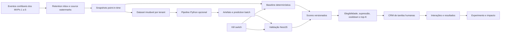

# MVP-06 — Retention AI Technical Design

**Status:** Aprovado em diálogo para registro e revisão

**PRD de origem:** `docs/prd/academia/MVP-06-retention-ai.md`

**Data:** 14/08/2026

## 1. Objetivo

Transformar risco explicável de churn em trabalho humano priorizado, auditável e mensurável. O produto deve entregar valor com uma baseline determinística mesmo quando o tenant não possui volume ou qualidade suficientes para ML supervisionado.

O score é uma recomendação operacional. Ele nunca bloqueia acesso, altera cobrança, concede desconto, envia mensagem ou modifica contrato automaticamente.

## 2. Decisões aprovadas

1. O MVP será dividido em dois trilhos:
   - **núcleo operacional obrigatório:** contrato de dados, snapshots, baseline, scores, CRM e experimento;
   - **ML supervisionado opcional:** pipeline Python independente, executável somente após gate estatístico e de governança.
2. Treino, avaliação e inferência supervisionada serão offline em Python. NestJS permanece responsável pelas decisões operacionais.
3. Baseline e modelos são isolados por tenant. Tenant sem volume suficiente permanece nas regras; não existe modelo compartilhado neste MVP.
4. O pipeline Python não acessa diretamente tabelas operacionais nem expõe API online. A integração ocorre por datasets e lotes versionados em object storage privado.
5. Regressão logística calibrada é a referência supervisionada. Gradient boosting pode ser challenger, nunca substituto presumido.
6. Randomização experimental é por aluno, estável, estratificada por unidade e faixa de risco, com análise por intenção de tratar.
7. O modelo começa em shadow mode e retorna à baseline por kill switch sem deploy.

## 3. Escopo e não objetivos

### 3.1 Incluído

- definição versionada de target, população, janelas e features;
- snapshots diários point-in-time, qualidade, completude e lineage;
- labels maduras sem leakage;
- baseline de regras versionadas e explicáveis;
- scores históricos, faixas e fatores objetivos;
- supressão, cooldown, capacidade top-K e CRM de retenção;
- contato humano e resultado operacional auditados;
- experimento controlado e relatório por intenção de tratar;
- registry próprio de regra/modelo, datasets e artefatos;
- pipeline Python supervisionado condicionado ao gate;
- shadow mode, champion/challenger, drift, kill switch e fallback.

### 3.2 Fora do escopo

- scoring online por requisição;
- LLM no score, na label ou na explicação;
- ação, campanha, desconto, bloqueio ou mensagem automática;
- dados de saúde sensíveis, biometria, diagnóstico ou composição corporal como feature inicial;
- treinamento cruzado entre tenants;
- causalidade individual ou promessa de que uma intervenção evitará churn;
- feed de vendas, automação de marketing ou CRM genérico;
- registry externo de ML antes de uma necessidade operacional comprovada.

## 4. Arquitetura



### 4.1 Núcleo NestJS

O monólito modular contém:

- `retention-data-contracts`: versões de target/features, watermarks e qualidade;
- `retention-snapshots`: materialização e reprodução point-in-time;
- `retention-scoring`: regras, score, explicações e seleção do provider ativo;
- `retention-tasks`: capacidade, cooldown, atribuição, contato e resultado;
- `retention-experiments`: elegibilidade, assignment e análise;
- `retention-model-governance`: datasets, registry, avaliações, shadow, promoção e kill switch;
- `retention-operations`: dashboard, drift, alertas, runbooks e rollout.

Módulos upstream são consumidos por portas públicas ou eventos. Retention não consulta tabelas privadas de access, billing, health ou engagement.

### 4.2 Pipeline Python

`pipelines/retention-ml/` será um pacote batch sem endpoint HTTP. Ele recebe um manifest de dataset imutável, treina/avalia um único tenant e grava:

- manifest de execução;
- métricas por split e período;
- artefato privado com checksum;
- model card;
- explicações e prediction batch em formato canônico.

O runner de infraestrutura fica atrás de `RetentionMlRunnerPort`. A homologação do executor local/cloud é um gate do trilho opcional e não bloqueia a baseline.

### 4.3 Persistência

PostgreSQL guarda metadados, lineage, snapshots operacionais, scores, tarefas, assignments, avaliações e estados. MinIO/S3 privado já previsto na arquitetura guarda datasets colunares, artefatos e relatórios grandes.

Não será introduzido MLflow no MVP. O registry mínimo é domínio do ArenaHub e usa PostgreSQL + object storage, reduzindo infraestrutura e mantendo a promoção integrada ao RBAC/auditoria existentes.

## 5. Contrato point-in-time

### 5.1 Dois tempos obrigatórios

Cada fonte relevante preserva:

- `occurredAt`: quando o fato ocorreu no domínio;
- `availableAt`: quando o fato se tornou utilizável pelo pipeline;
- `ingestedAt`: quando retention o registrou;
- `sourceEventId` e `schemaVersion`.

Uma feature do snapshot de `observationAt` só usa fatos com `availableAt <= observationAt` e `occurredAt` dentro da janela da feature. Isso impede que eventos atrasados façam o passado parecer mais conhecido do que era.

### 5.2 Identidade do snapshot

Um snapshot é identificado por:

```text
tenantId + studentId + observationDate + targetVersionId + featureSetVersionId + revision
```

Ele contém valores tipados validados por schema, indicadores de ausência, completude, quality flags, source watermarks e checksum. O JSON de features não é retornado nas listagens operacionais nem escrito em logs.

Reexecução para a mesma identidade converge ao mesmo checksum. Correção de código pode criar nova revisão usando o mesmo knowledge cutoff. Evento que só ficou disponível depois da observação não entra na revisão histórica de treino.

### 5.3 Label e maturação

Para uma observação `D`:

- janela de previsão: `D+1` até `D+30`;
- churn candidato: cancelamento ou expiração nessa janela;
- confirmação: ausência de reativação nos 30 dias posteriores ao churn candidato;
- label madura: no máximo em `D+60`.

Snapshots sem janela completa possuem label `IMMATURE` e não entram em treino, validação ou teste. A label é derivada de eventos, versionada e append-only; resultado de contato não a altera.

### 5.4 Features iniciais

Somente as features permitidas no PRD entram no primeiro feature set. Ausência permanece `missing`, acompanhada por indicador e razão. Zero significa valor observado igual a zero.

Sexo, raça inferida, biometria, diagnóstico, composição corporal e idade não entram na versão inicial. Engagement usa somente atividade opt-in agregada e permitida, nunca alias, ranking público ou medida corporal.

## 6. Baseline e contrato de scoring

Baseline e ML produzem o mesmo resultado canônico:

```ts
export interface RetentionScoreResult {
  provider: 'RULE_BASELINE' | 'SUPERVISED_MODEL';
  providerVersionId: string;
  band: 'LOW' | 'MEDIUM' | 'HIGH' | 'CRITICAL';
  calibratedProbability: number | null;
  completeness: number;
  factors: RetentionScoreFactor[];
  calculatedAt: string;
  observationAt: string;
}
```

### 6.1 Baseline

Regras são declarativas, versionadas, efetivas por data e determinísticas. Operadores iniciais cobrem queda de frequência, dias sem passagem confirmada, cobrança vencida, falhas de pagamento, pausa recente e tempo sem avaliação publicada.

Pesos, limites e faixas são calibrados operacionalmente e aprovados no gate. Mudança cria nova versão e não reescreve scores passados.

### 6.2 Explicações

Cada score possui até cinco fatores objetivos, com direção, valor apresentado de forma segura, referência à feature e texto versionado. A soma/ordem dos fatores deve ser coerente com o snapshot e provider.

Probabilidade só é exibida se houver calibração aprovada. Caso contrário, a interface mostra faixa, completude, data e aviso de estimativa, sem falsa precisão.

### 6.3 Idade e validade

Falha do pipeline preserva o último score com `asOf`, idade e estado `STALE`. O limite de validade vem da política operacional. Após expirar, o score deixa de priorizar novas tarefas; tarefas existentes continuam disponíveis.

## 7. Elegibilidade, supressão e capacidade

Antes de criar tarefa, o NestJS revalida:

- assinatura `ACTIVE` ou `PAST_DUE`;
- histórico mínimo;
- ausência de cancelamento já efetivo;
- ausência de exclusão pendente ou supressão aplicável;
- consentimento/canal para a estratégia;
- cooldown por aluno + estratégia;
- assignment experimental;
- capacidade diária da unidade/equipe.

Capacidade é um top-K diário configurado por tenant/unidade. Score fora do K permanece histórico e não cria backlog. No dia seguinte ele pode competir novamente se continuar elegível.

No máximo uma tarefa ativa por aluno e estratégia existe durante o cooldown. Reprocessar score ou job não duplica tarefa.

## 8. CRM de retenção

### 8.1 Estados

```text
OPEN → ASSIGNED → IN_PROGRESS → COMPLETED
                              ↘ DISMISSED
OPEN | ASSIGNED | IN_PROGRESS → EXPIRED
```

Transições exigem versão observada, ator, timestamp e motivo quando aplicável. Reatribuição mantém histórico. Conclusão e dispensa não alteram score nem label.

### 8.2 Templates e ação humana

Template define finalidade, perfis autorizados, canais permitidos, roteiro opcional, prazo, resultados possíveis e cooldown. Ele não envia mensagem nem aplica oferta.

Uma interação registra tarefa, responsável, canal, horário, resultado, próximo passo e consentimento verificado. Texto livre é minimizado e segue retenção própria. Canal indisponível ou não consentido deve ser recusado antes do registro como contato realizado.

## 9. Experimento operacional

### 9.1 Assignment

Assignment ocorre antes da primeira exposição, por hash estável de tenant, experimento, aluno e estrato. Estratos iniciais são unidade e faixa de risco da baseline congelada. O registro persistido vence qualquer novo cálculo e o aluno não muda de grupo.

O grupo controle não cria tarefa e não aparece para a equipe. Scores podem ser calculados para análise cega, com acesso restrito ao analista.

### 9.2 Métricas

- elegibilidade, assignment e exposição;
- tarefas criadas, aceitas, expiradas e dispensadas;
- contato e resultado;
- cancelamento, expiração, reativação e permanência;
- opt-out, reclamação e efeito adverso;
- tempo operacional e capacidade consumida.

A análise principal é por intenção de tratar. Relatório inclui tamanho, perdas, janelas, intervalos, limitações e efeitos adversos. Não é permitido trocar métrica primária ou remover grupos após observar o resultado.

## 10. ML supervisionado opcional

### 10.1 Gate

O pipeline só treina para um tenant quando há evidência registrada de:

- volume mínimo ou estudo estatístico substituto;
- seis meses de definições estáveis;
- qualidade por feature;
- labels maduras suficientes;
- splits temporais congelados;
- baseline congelada;
- fairness/proxies revisados;
- runner, storage, monitoramento e rollback homologados.

Falha em qualquer item mantém `RETENTION_ML_SHADOW=false` e `RETENTION_ML_ACTIVE=false`.

### 10.2 Pipeline

O pipeline scikit-learn usa `Pipeline`/`ColumnTransformer` para que imputação, indicadores de ausência, escala e modelo sejam ajustados apenas no conjunto de treino. Split temporal mantém treino antes de validação e teste; folds aleatórios que misturam tempo são proibidos.

Candidatos:

1. `LogisticRegression` com calibração avaliada;
2. `HistGradientBoostingClassifier` como challenger condicionado a explicação e estabilidade.

Métricas incluem prevalência, precision/recall no top-K operacional, average precision/PR-AUC, calibração, estabilidade temporal, cobertura e fairness permitida. ROC-AUC é complementar.

### 10.3 Registry e artefatos

Cada versão registra tenant, dataset manifest/checksum, commit do código, environment lock, parâmetros, seed, splits, métricas, limitações, artefato e model card. O artefato é privado, checksummed e carregado apenas pelo runner confiável.

Dados de fairness, quando legalmente permitidos, ficam em dataset de avaliação com acesso separado. Eles não são adicionados automaticamente às features.

### 10.4 Shadow, promoção e fallback

Modelo aprovado começa em shadow mode. O lote shadow não altera prioridade nem tarefa. A comparação usa os mesmos snapshots/high-water da baseline.

Promoção exige gate, teste temporal, ganho congelado, fairness, estabilidade, autorização distinta e auditoria. Kill switch em configuração persistida é verificado antes de executar o lote e antes de importá-lo. Seu efeito máximo é cinco minutos.

Modelo desativado volta à baseline. Scores/tarefas históricos mantêm provider/version para auditoria.

## 11. Segurança e isolamento

- toda tabela e chave de objeto inclui tenant;
- tenant vem do contexto autenticado ou manifest assinado, nunca do payload livre;
- dataset contém subject IDs pseudônimos específicos do tenant;
- runner recebe credencial curta e escopo mínimo para um prefixo de job;
- importador rejeita tenant, schema, checksum, feature set ou batch incompletos;
- promoção, kill switch, export e acesso individual exigem RBAC e audit log;
- logs/traces não contêm vetor, explicação individual, contato, score bruto ou PII;
- treino compartilhado é recusado por schema/policy, não apenas por convenção;
- opt-out/exclusão bloqueia snapshots e tarefas futuras e propaga a datasets conforme retenção aprovada.

## 12. Falhas e recuperação

| Falha | Comportamento |
|---|---|
| Fonte incompleta | snapshot marcado inválido; sem score silencioso |
| Evento duplicado | inbox/constraints convergem para um efeito |
| Snapshot ou score repetido | mesma versão/data retorna resultado idempotente |
| Baseline falha | tenant sem novos scores; tarefas existentes disponíveis |
| Runner Python falha | batch falha isolado; baseline continua |
| Artefato/checksum inválido | importação recusada e alerta de segurança |
| Batch parcial | nenhuma linha promovida |
| Drift crítico | alerta, desativação/fallback conforme política |
| Kill switch | novos lotes ML deixam de afetar prioridade em até cinco minutos |
| Scoring indisponível | CRM e interações permanecem operáveis |

DLQ e reprocessamento são isolados por tenant/data/provider. Reprocessamento não altera assignment experimental nem duplica tarefa.

## 13. Observabilidade

Métricas por tenant e versão, quando permitido:

- duração e atraso de snapshot/score;
- cobertura, completude e quality flags;
- idade do score e backlog/DLQ;
- distribuição de faixas;
- precisão/recall top-K quando labels amadurecem;
- calibração, drift de feature/score/resultado;
- capacidade, SLA e resultado das tarefas;
- opt-out, reclamação e indicadores adversos;
- estado do provider, shadow, champion e kill switch.

Alertas apontam impacto e ação: snapshot atrasado antes da operação, queda de cobertura, batch recusado, score expirado, drift, capacidade saturada e kill switch acionado.

## 14. Estratégia de testes

### 14.1 Domínio

- janelas e timezone;
- missing versus zero;
- label madura;
- elegibilidade/supressão;
- cooldown, top-K e estados da tarefa;
- assignment estável e imutável.

### 14.2 Point-in-time e pipeline

- eventos atrasados e knowledge cutoff;
- nenhum fit de preprocessing fora do treino;
- splits temporais e labels maduras;
- reprodutibilidade por seed/environment;
- calibração e métricas top-K;
- fairness somente em segmentos permitidos/viáveis;
- comparação congelada com baseline.

### 14.3 Integração e segurança

- isolamento de tenant em snapshot, score, tarefa, dataset e artefato;
- reexecução e concorrência;
- storage privado, credencial curta e checksum;
- batch parcial/adulterado;
- opt-out/exclusão e retenção;
- promoção sem gate e kill switch;
- fallback sem impacto em access, billing, app ou CRM.

### 14.4 E2E

```text
evento → snapshot → baseline → score → top-K → tarefa → contato → resultado → relatório
```

O trilho opcional acrescenta:

```text
snapshot → dataset → treino temporal → registry → shadow batch → comparação → promoção/fallback
```

## 15. Rollout

1. snapshots/qualidade sem exposição;
2. baseline em shadow;
3. scores somente para gerentes;
4. tarefas limitadas em uma unidade;
5. experimento controlado;
6. expansão da baseline por tenant/unidade;
7. ML shadow apenas em tenant que passa o gate;
8. ML active após promoção formal;
9. revisão periódica, expiração e relatório de impacto.

Flags: `RETENTION_BASELINE`, `RETENTION_TASKS`, `RETENTION_EXPERIMENT`, `RETENTION_ML_SHADOW`, `RETENTION_ML_ACTIVE`.

## 16. Decomposição dos planos

Após aprovação deste design, o implementation plan será dividido em:

1. gates de dados, privacidade, operação e ML;
2. Slice 6.1 — contrato de dados e snapshots;
3. Slice 6.2 — baseline e scores;
4. Slice 6.3 — CRM de retenção;
5. Slice 6.4 — experimento operacional;
6. plano opcional de ML — dataset, treino, registry e shadow;
7. Slice 6.6 — produção, monitoramento e impacto.

O plano opcional de ML não é pré-condição para concluir o núcleo operacional. A Slice 6.6 deve operar baseline e CRM mesmo quando o gate supervisionado estiver registrado como não atendido.

## 17. Critérios de consistência do design

- nenhum componente Python decide ou executa ação operacional;
- nenhum modelo mistura tenants;
- nenhuma feature futura entra em snapshot passado;
- nenhuma label imatura entra em treino/teste;
- nenhuma tarefa nasce sem elegibilidade, capacidade e consentimento aplicável;
- nenhum resultado de contato altera a verdade histórica do target;
- nenhum modelo é promovido sem baseline congelada e aprovação;
- nenhuma falha de retention afeta acesso, cobrança ou app;
- toda explicação aponta para features do snapshot/versionamento correto;
- qualquer rollback preserva trilha de scores, tarefas e decisões humanas.
