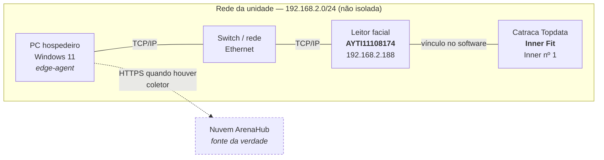

# Bancada do MVP 0 — runbook e diagrama

Como instalar a bancada e obter heartbeat. O aceite da Slice 0.1 é este documento
funcionar: **outro desenvolvedor segue o runbook e obtém heartbeat dos componentes
disponíveis**.

## Diagrama de rede

Topologia confirmada em 14/08/2026: **tudo por TCP/IP**. Não há serial, RS-485 nem porta
COM no caminho.



**O que o diagrama afirma e o que não afirma.** O vínculo leitor↔catraca é o que o
software de configuração mostra (campo *"Leitor facial 1"* na catraca). **Se o comando de
giro sai do PC direto para a catraca ou passa pelo leitor, ainda não foi verificado** — é
o que a F3 tem de descobrir, e por isso não está desenhado como seta de comando.

## Consequência de arquitetura: o ADR-010 fica mais simples

O ADR-010 pergunta se o SDK Topdata é Windows-only, porque isso mudaria a stack do
`edge-agent`. Com **TCP/IP puro no transporte**, essa pergunta encolhe:

- **não há porta COM** — o agente não precisa estar fisicamente ligado ao equipamento;
- **o transporte não é refém do Windows** — socket TCP é socket TCP em qualquer runtime;
- a dúvida sobrevive **só** para o SDK de captura biométrica, se ele existir como DLL.

Isso não fecha o ADR-010 — fechar é do PI, com o SDK em mãos. Mas estreita o que ele
precisa decidir.

## Instalação

### 1. Pré-requisitos

- Node na versão do `.nvmrc` (raiz do repositório)
- `pnpm`
- Acesso à rede onde o equipamento está

### 2. Instalar e configurar

```bash
pnpm install --frozen-lockfile
cp .env.example .env        # na raiz do repositório
```

No `.env`, preencha o que o `edge-agent` precisa:

```dotenv
EDGE_AGENT_ID=bancada-01
TENANT_ID=<uuid do tenant>
GYM_UNIT_ID=<uuid da unidade>
USE_SIMULATOR=true          # false só quando for falar com equipamento real
```

### 3. Diagnóstico — comece por aqui

```bash
pnpm --filter @arenahub/edge-agent diagnostico
```

**É somente-leitura.** Abre socket TCP e fecha; não envia comando, não escreve no
equipamento, não mexe em base nenhuma. Pode rodar com a catraca em operação.

Ele valida a configuração, valida este inventário contra o schema, testa alcance de rede
de cada dispositivo e lista as pendências do gate de entrada.

A saída **mascara segredos** — pode ser colada num chamado sem revisão.

### 4. Subir o agente

```bash
pnpm --filter @arenahub/edge-agent dev
```

Emite heartbeat imediato e depois a cada 30 s. Encerra com `Ctrl+C` de forma graciosa
(`M0-NFR-007`).

## Inventário

`inventory.yaml` — validado pelo schema Zod em `inventory.schema.ts`.

**Campo desconhecido é `null`, nunca palpite.** O PRD §4 é explícito: *"não se substitui
hardware real por suposição"*. O schema garante que o campo foi **considerado**, não que
alguém inventou valor para ele.

Os campos ainda `null` (nº de série da catraca, firmware, versão exata do Windows) se
obtêm na máquina da bancada — etiqueta física e menu do equipamento.

### Vocabulário Topdata, para o inventário não mentir

No software de configuração, **"Utiliza biometria" significa digital** — e está
desmarcado. O reconhecimento facial é **equipamento separado**, referenciado no campo
*"Leitor facial 1"*. Tratar os dois como a mesma coisa produz inventário errado.

## Gate de entrada — 7 itens, PRD §4

O diagnóstico lista o que falta. Estado em 14/08/2026:

| item | estado |
|---|---|
| inventário com nº de série | parcial — leitor sim, catraca não |
| firmware registrado | não |
| SDK disponível legalmente | parcial — SDK público; licença não verificada |
| Windows e rede isolada | parcial — Windows 11 sim, **rede não é isolada** |
| diagrama físico aprovado | **este documento** — aguarda aprovação do PI |
| consentimento dos participantes | não |
| parada de emergência definida | não |

**F1 não depende de nenhum deles** — é workspace, configuração e observabilidade.

**F2 e F3 dependem.** Comandar a catraca tem efeito físico imediato, e a F3 precisa de
janela combinada. O consentimento é pré-requisito de qualquer captura facial.

## A base do ArenaHub é separada

A catraca roda hoje o software que veio de fábrica, com 48 pessoas cadastradas. **O
ArenaHub substitui esse software e usa base própria** — não estende nem sincroniza com
ela.

Os usuários existentes entram por **importação, em fatia futura**, fora do MVP 0. Por
isso escrever na base do ArenaHub não afeta o que está instalado.

**Nenhum dado de pessoa entra neste repositório** — nem em fixture, nem em golden file,
nem em log de erro (`CLAUDE.md` → *Regras de trabalho*). O inventário registra só a
**quantidade**.
